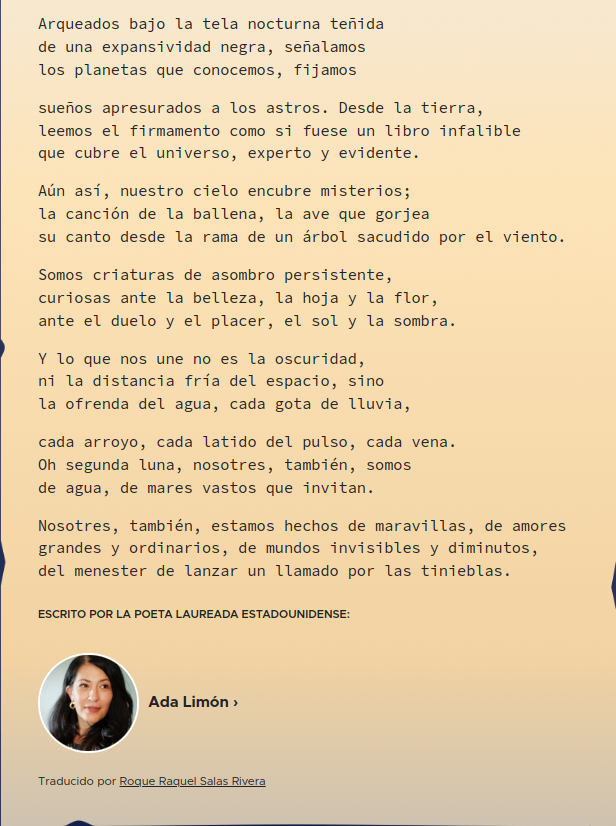

# Autor

Federico Coca

* [GitHub](https://github.com/fgcoca)

* [Twitter](https://twitter.com/fgcoca)

* [Instagram](https://www.instagram.com/cocafederico/?hl=es)

* [Mas información](https://fgcoca.github.io/Como-documento/about/)

* En octubre de 2024 he puesto mi nombre para que viaje en la sonda [Europa Clipper](https://es.wikipedia.org/wiki/Europa_Clipper) a estudiar el satélite Europa mientras gira alrededor del planeta Júpiter. La operación de la [NASA](https://es.wikipedia.org/wiki/NASA) se denomina **Message in a bottle** teniendo prevista su llegada en el 2030 tras recorrer 2900 millones de kilómetros (1800 millones de millas). El nombre viaja como firma de un poema escrito por Ada Limón, poetisa laureada estadounidense de ascendencia mexicana. En las imágenes siguientes vemos un captura del poema y el mensaje en la botella.

<iframe width="980" height="410" src="https://europa.nasa.gov/message-in-a-bottle/check-in?hash=PL%2BvM41YZDXS%2Bwl7qBFpTw%3D%3D--8eXXEAc4RCwTcy49--V3OPIwnh%2BpxpYkdYkM5yjw%3D%3D&embed=true" frameborder="0"></iframe>
