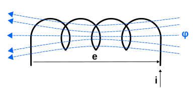

# La bobina
La bobina o inductor es un elemento pasivo que almacena energía en el núcleo en forma de campo magnético y la devuelve al circuito cuando es necesario, convirtiendo la energía de la corriente eléctrica en energía del campo magnético o viceversa. Este fenomeno es lo que se conoce como autoinducción.

Cuando la corriente que circula por la bobina cambia, el campo magnético variable con el tiempo induce una [fuerza electromotriz](https://es.wikipedia.org/wiki/Fuerza_electromotriz) (f.e.m. o tensión) en el conductor según describe la [ley de inducción electromagnética de Faraday, o ley de Faraday o ley de Faraday-Lenz](https://es.wikipedia.org/wiki/Ley_de_inducci%C3%B3n_de_Faraday), que no debe confundirse con las leyes de Faraday sobre la electrólisis. La tensión inducida (según la [ley de Lenz](https://es.wikipedia.org/wiki/Ley_de_Lenz)) tiene una determinada dirección (polaridad) que tiende a oponerse al cambio de la corriente que la ha creado. Se puede afirmar que una bobina se opone a cualquier cambio en la corriente que los atraviesa.

Una bobina viene caracterizada por su inductancia, que es la relación entre la tensión y las variaciones de corriente. Su unidad de medida en el sistema internacional es el henrio (H). Se trata de una unidad muy grande por lo que se suelen utilizar los submúltiplos mH (mili henrio) y $\mu H$ (micro henrio).

En la imagen siguiente vemos un gráfico de una bobina sometida a una fuerza electromotriz (fem) que origina una corriente por el conductor que la forma y a su vez un flujo magnético en la dirección indicada.

  
*Flujo magnético en una bobina*

Donde "e" es la fem en voltios, "i" a la corriente eléctrica que circula por la bobina, $\varphi$ es el flujo magnético y "L" a su inductancia medida en henrios, se puede expresar que:

$e=-\dfrac{d\varphi}{dt} = -L\dfrac{di}{dt} \Rightarrow i=\dfrac{1}{L} \int_0^T e \: \mathrm{d}t + i_0$

Indicando claramente la oposición a las variaciones de corriente dado que L es una constante.

Una bobina se construye habitualmente con hilo de cobre esmaltado que se enrrolla alrededor de un núcleo (puede ser el aire) ferroso para incrementar su capacidad de magnetismo. A continuación podemos observar el aspecto real de diferentes bobinas y el símbolo electrónico del inductor.

  
*Bobina, aspecto real y símbolo*

En el video de KEMET Electronics (*"Así que crees que entiendes los inductores"*):

[KEMET Webinar | So You Think You Understand Inductors](https://www.youtube.com/watch?v=ialxfpA-2ho)

nos introducen las bobinas de una forma bastante clara.

Además de como componente pasivo, las bobinas forman parte de elementos como transformadores, filtros, relés, etc.

Una bobina almacena energia en forma de campo magnético por efecto del flujo creado por la corriente electrica. Se mide como la relación entre las variaciones de tensión o corriente con respecto al tiempo.

$v=L\dfrac{di}{dt}$

$i=\dfrac{1}{L} \int_0^T v \: \mathrm{d}t + i_0$

La relación entre la tensión en la bobina, la corriente que circula por ella y el tiempo se expresa graficamente como vemos a continuación:

  
*Tensión y corriente en la bobina*

La carga y descarga de la bobina se realiza de manera exponencial según una constante de tiempo $\tau = L/R$. Observamos que tanto la carga como la descarga se pueden considerar completas al cabo de un tiempo $t = 4\tau$. Las expresiones que definen la corriente que circula por la bobina y la tensión entre sus extremos son:

$I=\dfrac{V_b}{R}(1-e^{-t/\tau}) \space \space y \space \space V_L = V_b \cdot e^{-t /\tau}$

