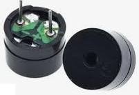

# Reproductores de sonido
Antes de ver el amplificador propiamente dicho vamos a ver los tipos de zumbadores ya que las placas microcontroladas tipo Arduino, Raspberry Pi Pico, etc, producen los sonidos en base a generar ondas cuadradas de diferentes frecuencias.

El buzzer, zumbador o altavoz es un transductor electroacústico (convierte una señal eléctrica en una onda de sonido) que produce un determinado zumbido o sonido. Existen de tres tipos:

* *Pasivos*: no disponen de electrónica interna, por lo que tenemos que proporcionar una señal eléctrica para conseguir el sonido deseado.
* *Activos*: disponen de un oscilador interno, por lo que únicamente tenemos que alimentar el dispositivo para que se produzca el sonido.
* *Módulos amplificados*: disponen de un pequeño amplificador que entrega su salida a un altavoz.

Uno de los parámetros que caracterizan a un sonido es su frecuencia de emisión, siendo la frecuencia el número de veces que se repite por unidad de tiempo (segundo). La transmisión del sonido se realiza por ondas a través en cualquier medio (sólido, líquido o gaseoso) excepto en el vacío. La frecuencia de un sonido nos indica cuantos ciclos por segundo tiene una onda.

En la imagen y la tabla siguientes vemos un dibujo con un fragmento de las teclas de un piano estando todo referido a una nota estándar, la nota "La" central que tiene una frecuencia de 440 Hz. Podemos ver la nota musical que reproduce, en las dos notaciones más comunes de los sonidos (Inglés: C D E F G A B, Alemán: C D E F G A H, Español, italiano y francés: Do Re Mi Fa Sol La Si) y además se encuentra la frecuencia que produce esa nota musical.

  
*Sección de piano y notas*

Otro de los parámetros que caracterizan al sonido es su nivel y en sonido se caracteriza con los decibelios (dB) que es la forma de medir la intensidad del sonido. La percepción del sonido depende de factores como la intensidad, el tiempo que dura, las frecuencias o tonos y el entorno donde estamos. Vamos a introducir brevemente como medir la intensidad del sonido.

Los decibelios (dB) son la unidad de medida de presión acústica. Medimos presión, luego estamos midiendo una fuerza y mas concretamente una fuerza por unidad de superficie. Un sonido pierde intensidad según nos alejamos de la fuente y lo hace a un ritmo de unos 6 dB cada que vez que se duplica la distancia. Vemos un ejemplo: supongamos que escuchamos un sonido de 45 dB a una distancia de un metro, cuando nos pongamos a dos metros escucharemos 39 dB, cuando estemos a 4 metros, será de 33 dB y cuando estemos a 8 metros, de 27 dB.

La escala de medida en dB no es lineal, es logaritmica porque representa mejor la forma en que sentimos los cambios de la intensidad del sonido con nuestro oido. Algunos datos para reflexionar sobre el ruido:

* El sonido se vuelve dañino para el ser humano a partir de los 75 dB.
* Alrededor de los 120 dB causa dolor. Una exposición de dos horas a 100 dB necesita un día completo para que el oido compense la exposición.
* Sonido en torno a 180 dB pueden ocasionar la muerte.

En la tabla vemos algunos ejemplos del día a día:

|nivel de sonido|Percepción|Situación|
|---|---|---|
|0 dB|Muy bajo|Nivel de audición humano|
|10 a 30 dB|Nivel bajo|Conversación tranquila. Biblioteca|
|30 a 50 dB|Nivel bajo|Conversación normal. Motor frigorifico. Agua saliendo del grifo|
|55 a 75 dB|Nivel considerable|Aspirador. Calle con trafico denso. Despertador. Batidora|
|75 a 100 dB|Nivel alto|Sensación molesta. Atasco de tráfico. Sirena de policia|
|100 a 120 dB|Muy alto|Taladro/claxon/concierto R&R = 120 dB. Interior discoteca = 110 dB|
|mas de 120 dB|Dolor|Avión despegando a 25 metros. Petardo a un metro|

Una equivalencia que nos puede ayudar a familiarizarnos con esta unidad es la tabla de equivalencias entre potencias y dBm (decibelios milivatio):

| P (mW) | dBm | P (mW) | dBm | P (mW) | dBm | P (mW) | dBm |
|:-:|:-:|:-:|:-:|:-:|:-:|:-:|:-:|
| 1 | 0 | 16 | 12 | 250 | 24 | 4 W | 36 |
| 1.3 | 1 | 20 | 13 | 315 | 25 | 5 W | 37 |
| 1.6 | 2 | 25 | 14 | 400 | 26 | 6 W | 38 |
| 2 | 3 | 32 | 15 | 500 | 27 | 8 W | 39 |
| 2.5 | 4 | 40 | 16 | 630 | 28 | 10 W | 40 |
| 3.2 | 5 | 50 | 17 | 800 | 29 | 13 W | 41 |
| 4 | 6 | 64 | 18 |  1 W | 30 | 16 W | 42 |
| 5 | 7 | 80 | 19 | 1.3 W | 31 | 20 W | 43 |
| 6 | 8 | 100 | 20 | 1.6 W | 32 | 25 W | 44 |
| 8 | 9 | 125 | 21 | 2 W | 33 | 32 W | 45 |
| 10 | 10 | 158 | 22 | 2.5 W | 34 | 40 W | 46 |
| 13 | 11 | 200 | 23 | 3 W | 35 | 50 W | 47 |

Si observamos cuidadosamente la tabla veremos que la potencia se duplica o divide por dos, según recorramos la tabla, cada 3 dB.

## **Zumbador pasivo**
Un zumbador o buzzer pasivo no es mas que un pequeño altavoz que nos sirve para convertir una señal eléctrica en una onda de sonido. Son dispositivos que no disponen de ningún tipo de electrónica interna, por lo que tenemos que proporcionar una señal eléctrica para conseguir el sonido deseado.

Normalmente estos dispositivos se incluyen en un módulo que incorpora un transistor y una resistencia de polarización del mismo para hacer funcionar al altavoz que actúa como carga.

Un buzzer se basa en un transductor piezoeléctrico que es capaz de variar su volumen con el paso de la corriente eléctrica, fenómeno que se aprovecha para hacer vibrar la membrana del altavoz. Esquemáticamente vemos esto en la figura siguiente:

  
*Funcionamiento de un buzzer*

Un zumbador pasivo requiere para su funcionamiento una señal de tipo PWM para poder indicarle la frecuencia y la duración de la señal.

El aspecto por ambos lados nos ayudará a distinguirlo del activo.

  
*Aspecto de un buzzer pasivo*

## **Zumbador activo**
Existe otro tipo de zumbador que incluye un oscilador que genera una frecuencia audible fija y que se conoce como zumbador pasivo y en realidad es el que de forma correcta se puede denominar como zumbador. Este es mucho mas sencillo de usar ya que basta con conectarlo a un pin digital y cuando pongamos a nivel alto este pin el zumbador generará su zumbido característico durante el tiempo que establezcamos. Con este tipo de zumbador no se pueden generar melodías.

Cuando está nuevo se distingue del zumbador pasivo o altavoz por la pegatina de protección que lo acompaña, pero esta hay que quitarla para oir el zumbido y sin ella es difícil distinguir un tipo del otro, así que en este caso deberemos crear un programa con alguna melodía y si no se reproduce correctamente es que tenemos conectado el zumbador activo en lugar del pasivo. Lo mejor es marcar alguno de los dos cuando podemos distinguirlos. Una buena idea puede ser utilizar la propia pegatina en el lateral del mismo.

El zumbador activo tiene el aspecto que vemos en la figura siguiente:

  
*Aspecto de un zumbador activo*

Un zumbador activo produce un tono audible fijo con tan solo aplicarle tensión.

El aspecto por ambos lados nos ayudará a distinguirlo del pasivo.

  
*Aspecto de un buzzer activo*

## **Excitación de zumbadores**
Cualquiera de los zumbadores vistos van a requerir una corriente mayor de la que un pin GPIO de la Raspberry Pi Pico tiene capacidad de entregar a su salida, por lo que no podemos atacarlo directamente y será necesario recurrir a un transistor para amplificar la corriente.

Como existen dos tipos de transistores semiconductores (PNP y NPN) vamos a poder disponer de dos circuitos de excitación similares basados en el uso de un transistor como amplificador de corriente y así poder manejar la corriente de excitación del buzzer con la corriente de colector del transistor y utilizar la corriente de salida del pin GPIO comocorriente de excitación en la base del transistor.

Si se utiliza un transistor NPN para controlar un zumbador el esquema del circuito es el de la figura siguiente:

  
*Circuito de excitación con transistor NPN*

Si GPIO emite un nivel alto, circula corriente a través de R1, el transistor se saturará haciendo circular corriente entre emisor y colector con lo que el zumbador sonará. Si la salida GPIO está a nivel bajo, no circula corriente a través de R1, el transistor no conduce y el zumbador no sonará.

Si se utiliza un transistor PNP para controlar un zumbador el esquema del circuito es el de la figura siguiente:

  
*Circuito de excitación con transistor PNP*

Si GPIO emite un nivel bajo, circula corriente a través de R1, el transistor se saturará haciendo circular corriente entre emisor y colector con lo que el zumbador sonará. Si la salida GPIO está a nivel alto, no circula corriente a través de R1, el transistor no conduce y el zumbador no sonará.

## **Introducción a la amplificación**
Un amplificador es un dispositivo capaz de aumentar en su salida lo que introducimos en su entrada. Existen dos magnitudes que relacionan la salida con la entrada, normalmente en función de la frecuencia, y son:

* Función de transferencia del amplificador
* Amplitud de la señal de salida respecto a la entrada o ganancia.

Los amplificadores electrónicos son los mas conocidos y comunes y suelen formar parte de muchos aparatos como televisiones, teléfonos, instrumentos musicales, etc.

Un amplificador se puede construir con diferentes elementos activos, como válvulas de vacio, transistores BJT o MOSFET o incluso podemos considerar como amplificador un relé, capaz de gobernar en sus contactos tensiones mucho mayores que en la entrada o contactos de la bobina de excitación. Estos elementos permiten fabricar dispositivos complejos que tengan como función la de amplificar. Se incluyen también en el concepto los amplificadores operacionales y por ende los de instrumentación.

Existe un tipo de amplificador diseñado especialmente para el trabajo en audio que se suelen dividir en dos categorías, los preamplificadores, que es donde se realiza la recepción y el control de la señal, y las etapas de potencia que es  donde se aumenta la potencia de la señal.

La finalidad principal del amplificador es aumentar la señal de entrada procedente de un micrófono, equipo reproductor, instrumento, etc (que es una señal compleja de un nivel de tensión muy bajo) y llevar a cabo un aumento de la misma procurando modificar (distorsionar) dicha señal lo menos posible en cuanto a la información que porta.

### Características de amplificadores
Son las que definen cada modelo concreto y en base a las que podemos determinar su calidad:

* **Impedancia**. Es la oposición que presenta un dispositivo al paso de la corriente alterna. En un amplificador hay dos impedancias características, la de entrada que será tipicamente superior a los $10k\Omega$ que estará en concordancia con la de los elementos de entrada y la de salida, que será tipicamente de 8 o 16 ohmios, que suele ser la impedancia de los altavoces o elementos que se conectan a las salidas del amplificador.
* **Amortiguación**. Es un factor que indica la relación entre la impedancia de salida del amplificador y la del altavoz. Este factor debe ser lo mas elevado posible, por encima de 200. Esto viene a indicar, por ejemplo que sobre un altavoz de 8 ohmios y un factor de 300 tenemos un factor de amortiguamiento de 0,027. Este factor se suele indicar con un valor para una impedancia de altavoz y a una frecuencia determinada tipicamente de unos 40 Hz.
* **Potencia de salida**. Expresa la cantidad de energia que puede entregar el amplificador sin distorsionar en exceso la señal. Es importante que esta potencia esté indicada como valor eficaz o RMS, dado que es el valor que realmente se puede transformar en energia y también, si estamos hablando de un amplificador estereo, si la potencia está indicada por canal o es la total. Este parámetro está relacionado con la impedancia de los altavoces, y si por ejemplo se especifica una potencia de 150 vatios RMS por canal para 16 ohmios, si ponemos altavoces de 8 ohmios la potencia será de 300 vatios por canal.
* **Relación señal/ruido**. Es indicativo del nivel de tensión del ruido residual presente en la salida. El parámetro se suele expresar en decibelios (dB) y para que esta relación esté por debajo del umbral de audición debe ser mayor de 100 dB.
* **Acoplamiento**. Es la forma en que se conecta el amplificador con el altavoz. Si están conectados directamente, sin etapas intermedias, se llama acoplamiento directo.
* **Respuesta en frecuencia**. Idealmente un amplificador de audio debería entregar una respuesta plana en el rango de frecuencias audibles (20 Hz a 20 kHz) a potencias bajas. Se indica en dB sobre impedancia de 8 ohmios y debe ser de unos $\pm 5dB$.
* **Ganancia**. Se trata de la relación entre la potencia de salida y la de entrada y se suele expresar en dB. Si esta ganancia es inferior a la unidad se habla de atenuación. El dB como tal solamente expresa una relación sin hacer referencia a ninguna magnitud. Usualmente esta referencia se indica de la siguiente forma:
  * [ ] - *dBw* indica referencia a vatios. A 1W de potencia le corresponden 0 dBw.
  * [ ] - *dBm* indica referencia a milivatios. A 1 mW le corresponden 0 dBm.
  * [ ] - *dBu* indica el nivel de señal en dB referido a 0,775 voltios. Estos 0,775V aplicados a una impedancia de 600 ohmios desarrollan una potencia de 1 mW. Se elige el valor de 600 ohmios porque es donde coinciden los valores en dBm y dBu.
* **Sensibilidad**. indica el nivel de señal de entrada necesario para producir la máxima potencia de salida. Si este valor se supera la señal de salida sufrirá una importante distorsión pudiendo incluso a producir daños en los equipos. Los equipos profesionales suelen incorporar un nivel de control de entrada que atenuará la señal introducida si resulta necesario para no llegar a distorsionar en la salida. Se suele expresar con el parámetro THD (Total Armonic Distortion) que es la distorsión armónica y que debe ser inferior al 0,1%.

### Módulos amplificadores
Comercialmente existen muchos modelos de amplificadores para microcontroladores que podemos utilizar y algunos específicos para la Raspberry Pi Pico. Vamos a ver algunos ejemplos:

#### picoaudio de Pimoroni
Se trata de una placa complementaria de audio estéreo I2S de alta calidad para la Raspberry Pi Pico, con toma amplficada de auriculares y salidas de línea no amplificadas.

Pico Audio Pack usa un PCM5100A DAC para emitir audio digital estéreo de hasta 32 bits y 384 KHz a través de su conector de salida de línea de 3.5 mm, listo para conectarse a un amplificador externo o altavoces autoamplificados. También puede emitir audio estéreo amplificado desde el conector para auriculares de 3.5 mm.

Es importante tener en cuenta esto:

**¡Actualmente Pico Audio Pack solo funciona programando en C/C++!**. Está previsto el soporte para Micro Python pero aún no está disponible.

  
*Aspecto del Pico Audio*

#### picoaudio de Wavesahre
La placa Pico-Audio es un módulo de expansión de audio diseñado para Raspberry Pi Pico, que incorpora un decodificador estéreo de baja potencia PCM5101A y utiliza un bus I2S para transmitir la señal de audio. Admite una frecuencia de muestreo de audio de amplio rango, permite la salida de señal de auriculares y altavoces al mismo tiempo.

* Estándar Raspberry Pi pico
* Conector de audio estándar de 3.5 mm, para conectar auriculares externos
* Cabezales de altavoz de dos canales
* Tasa de muestreo de audio de 8 a 384000 Hz
* Salida de sonido estéreo

Especificaciones:

* Tensión de alimentación: 5V
* Nivel lógico: 3.3V
* Decodificador de audio: PCM5101A
* Bus de audio: I2S
* DAC SNR: 106 dB
* Potencia de salida: 2.6 W/canal con altavoz de 4Ω
* Raspberry Pi Compatibilidad de encabezado Pico
* Pines hembra para conexión directa a Raspberry Pi Pico y macho por la otra cara para apilar otros módulos.

  
*Aspecto del Pico Audio*

#### Módulos amplificador KS0374 de keyestudio
El módulo amplificador de potencia KS0374 de keyestudio integra un potenciómetro para ajuste del volumen, un altavoz y el amplificador de audio 8002B. El chip es un amplificador de 2W clase AB capaz de entregar los 2W de potencia a una carga de tres ohmios con una distorsión menor al 10% a partir de una alimentación de 5V. Típicamente el amplificador entrega en torno a los 2W para una carga de ocho ohmios.

Lo mas apropiado es ajustar el volumen del sonido al mínimo antes de usarlo, para luego aumentarlo a voluntad, evitando así sobresalto y que se estropee el altavoz.

Sus parámetros principales son:

* Chip amplificador: SC8002B
* Tensión de alimentación: 5V DC
* Consumo: ≥500MA
* Potencia máxima: 2W
* Temperatura de funcionamiento: de 0 a 40°
* Volumen de sonido del altavoz: 80db

En la figura siguiente vemos el aspecto que presenta el módulo.

  
*Aspecto del módulo KS0374*

Se puede observar que el altavoz es de membrana y bobina móvil por lo que es algo similar a lo que vemos en la figura siguiente:

  
*Altavoz de bobina móvil*

## **Auriculares**
Existen de muchos tipos, formas y aplicaciones. Veamos un breve resumen de los mismos:

* **Circumaurales**. Seguramente los mejores de todos en cuanto a calidad de sonido. Se conocen también por auriculares HiFi. Son caros.
* **Supraurales**. Se suelen conocer como portátiles. Centra el apoyo en la oreja lo que los hace algo incomodos. Buena calidad de sonido. Suelen ser plegables.
* **Mini supra**. Pueden ser tipo diadema o con enganche para la oreja. Peor calidad de sonido que los anteriores. Suelen usarse cuando tenemos que estar en movimiento.
* **Intra aurales**. Se introducen en el conducto auditivo al estilo de los audifonos, lo que aisla muy bien del sonido exterior. Son de última generación y dan una calidad de sonido muy buena. Suelen seer inalámbricos.
* **De botón**. Parecidos a los intra aurales pero sin entrar en el conducto auditivo, solo en la oreja. Son los que peor calidad de sonido ofrecen dado que no aislan nada del exterior.

  
*Auriculares*

## **Micrófonos**
Un micrófono es un dispositivo de entrada que sirve para transformar ondas sonoras en energia electrica y vicerversa en procesos de grabación.

Existe multitud de tipos de micrófonos para distintas aplicaciones en las que no vamos a entrar. En el [enlace](https://es.wikipedia.org/wiki/Micr%C3%B3fono#:~:text=Un%20micr%C3%B3fono%20funciona%20como%20un,su%20intensidad%2C%20transmitirla%20y%20registrarla.) tienes un amplio artículo sobre los mismos.

Existe un tipo denominado MEMs ("Microelectromechanical systems" en inglés) que también se denominan chips microfónicos y son variantes del micrófono a condensador. El diafragma sensible está grabado sobre la oblea de silicio y suelen integrarse con un amplificador incorporado.

Un micrófono funciona como un transductor o sensor electroacústico y convierte el sonido (ondas sonoras) en una señal eléctrica para aumentar su intensidad, transmitirla y registrarla.

El SPU0410LR5H-QB consta de un sensor acústico, un búfer de entrada de bajo ruido y un amplificador de salida. El dispositivo tiene un alto rendimiento acústico de banda ancha y RF. Es un micrófono omnidireccional, en el que se considera que su respuesta es como una esfera en tres dimensiones.

  
*Aspecto del micrófono SPU0410LR5H-QB*

En el [datasheet](../datasheet/SPU0410LR5H_QB.pdf) tenemos toda la información del dispositivo.
