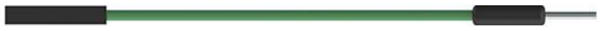

# Cables y conectores

## **Cables Dupont**
En electrónica se utilizan multitud de cables y conectores especializados por características y por aplicación. Para lo que nos interesa existen unos componentes básicos conocidos como puentes, jumpers o cables dupont que están diseñados para interconectar componentes mediante la inserción de sus dos terminales.

Estos cables utilizan en sus extremos (lo llevan crimpado) o bien conectores macho (Male) o bien hembra (Female), por lo que se pueden clasificar en los tres tipos siguientes, que se comercializan en diferentes colores y longitudes.

|Conexiones|Cable|
|:-:|:-:|
|macho-macho (M/M)||
|hembra/hembra (F/F)||
|macho/hembra (M/F)||

En la tabla siguiente damos una breve información de los calibres de cables relacionando las dimensiones en nomenclatura norteamerica y europea.

|<!-- -->| <!-- -->| <!-- -->| <!-- -->| <!-- -->| <!-- -->| <!-- -->|
|---|:-:|:-:|:-:|:-:|:-:|:-:|
|$AWG$|10|12|14|16|18|20|
|$inch$|0.1|0.08|0.06|0.05|0.04|0.03|
|$mm$|2.6|2|1.6|1.3|1.0|0.8|
|$mm^2$|5.27|3.3|2.09|1.31|0.82|0.52|

## **Protoboard**
También conocida como breadboard es una placa con multitud de agujeros interconectados de una determinada manera formando grupos de conexiones. Permiten montar de forma rápida circuitos temporales mas o menos sencillos. Existen de muchos tamaños diferentes de los que vemos una muestra en la imagen.

  
*Placas protoboard*

Hay dos cosas importantes en este tipo de componente, la primera es no introducir en los agujeritos componentes o cables de mas de 0.5mm de diámetro porque a la larga esto provocará falsos contactos con otros componentes y la segunda es tener muy claro como van conectados internamente los agujeros.

  
*Conexiones internas en placas protoboard*

La parte posterior de una protoboard como la anterior muestra el aspecto siguiente cuando le quitamos la tapa de protección.

  
*Parte trasera de una placas protoboard*

A continuación vemos mas en detalle su interior, observando que cuenta con unas láminas de metal que se encargan de sostener y conectar los terminanles de los componentes y los hilos de conexión.

  
*Parte trasera de una placas protoboard*

