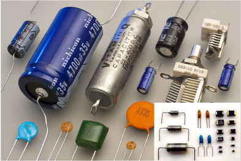
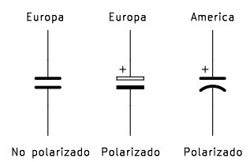

# El condensador
Un condensador es un elemento pasivo capaz de almacenar energia en forma de campo eléctrico. Está formado, en su forma mas simple, por dos láminas o placas plano-paralelas metálicas (electrodos) separadas entre si una distancia por un material denominado dieléctrico, que puede ser el aire. Existen multitud de tipos de condensadores y tamaño de los mismos de los que vemos una muestra en la imagen siguiente:

  
*Aspecto real de condensadores*

En la práctica estas placas suelen ser de aluminio y el dieléctrico puede ser aire, cerámica, papel, mica, etc.

Existen condensadores que no presentan ninguna polaridad en sus patillas, como los cerámicos, y otros que si la tienen, como los electrolíticos.

En la figura siguiente tenemos los símbolos electrónicos usuales de estos componentes:

  
*Símbolo de condensadores*

A continuación podemos ver un video de [CEDU Uninorte](https://www.youtube.com/@CeduUninorte) publicado el 19 de enero de 2017 en [Wikipedia](https://es.wikipedia.org/wiki/Condensador_el%C3%A9ctrico) donde se explican claramente los conceptos relacionados con el componente:

<iframe width="560" height="315" src="https://www.youtube.com/embed/wy8agb7S_fw?si=6Fr9S0MwS3H3g_DY" title="YouTube video player" frameborder="0" allow="accelerometer; autoplay; clipboard-write; encrypted-media; gyroscope; picture-in-picture; web-share" allowfullscreen></iframe>

En este otro video de KEMET Electronics (*"Así que crees que entiendes los condensadores"*):

[KEMET Webinar | So You Think You Understand Capacitors](https://www.youtube.com/watch?v=iW6fTBlJJM0)

nos hacen otra introducción a los condensadores de una forma bastante clara.
