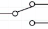
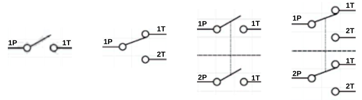
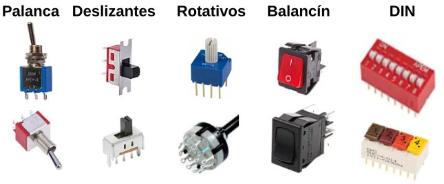
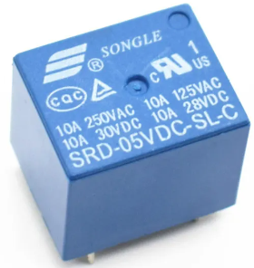

# Pulsador e interruptor

## **Pulsador**
Un botón pulsador o abreviadamente pulsador es un componente eléctrico que permite o impide el paso de la corriente eléctrica cuando se acciona. El pulsador solo permanece abierto o cerrado cuando lo presionamos y unicamente mientras lo mantenemos presionado. Al soltarlo vuelve a su posición inicial o de reposo.

En función de como están los contactos cuando el pulsador está en reposo, tenemos dos tipos diferentes: Normalmente Abierto y Normalmente Cerrado. Siendo el mas utilizado es pulsador normalmente abierto.

El funcionamiento del pulsador normalmente abierto es:

- Pulsador en reposo: el pulsador esta abierto y la corriente no puede pasar a través del mismo.
- Pulsador accionado: se conoce como posición de Trabajo y mientras se mantenga pulsado la corriente puede pasar por el pulsador.

En la tabla siguiente vemos la simbología y algunos ejemplos del aspecto físico de estos elementos del tipo que habitualmente se utiliza con este tipo de placas.

  
*Símbolos y aspecto real de un pulsador*

Existen muchos tipos y formas de pulsadores, pero los mas utilizados con este tipo de placas los vemos a continuación. Los de mayor tamaño suelen ir acompañados de una pieza de diferentes colores para colocar por presión en la parte amarilla (puede ser de otros colores) el pulsador y crear una tecla. Se aprecian las dimensiones así como la forma en que van conectados internamente los pines.

  
*Pulsadores mas usuales*

Mediante la configuración adecuada podemos convertir un pulsador en un elemento de entrada a algún pin de nuestra placa de control. Las configuraciones más básicas posibles con pulsadores las podemos ver en la imagen siguiente.

  
*Configuración circuito elemental con pulsador*

## Interruptor
La diferencia entre un pulsador y un interruptor radica en que el pulsador no mantiene su posición de trabajo si dejamos de accionarlo mientras que el interruptor si mantiene la posición, permaneciendo en la misma hasta que volvamos a accionarlo. Es decir, el interruptor cambia de posición cada vez que lo accionamos siendo totalmente estable cada posición. Hay ocasiones en que visualmente incluso pueden parecer iguales y solo se diferencian en su modo de funcionamiento.

Los interruptores se clasifican en función del tipo de conexión que realizan, como son el número de polos (Pole) y el de circuitos (Throw). Se define el número de polos como el número de circuitos capaz de controlar el interruptor. Puden ser unipolares, para un solo circuito o bipolares para controlar dos circuitos separados. Podemos decir que un interruptor bipolar son dos interruptores unipolares accionados por el mismo actuador. Por otro lado Throw se refiere al número de salidas que tiene cada polo. En base a esto tenemos:

|Tipo|Procedencia|Significado|Símbolo|
|:-:|---|---|:-:|
|SPST|Single Pole, Single Throw|Un polo, un circuito||
|SPDT|Single Pole, Double Throw|Un polo, dos circuitos||
|DPST|Double Pole, Single Throw|Dos polos, un circuito||
|DPDT|Double Pole, Double Throw|Dos polos, dos circuitos||

En la imagen siguiente quedará mas claro el tema de Pole y Throw.

  
*SPST, SPDT, DTSP y DPDT*

En el caso de los interruptores también pueden ser Normalmente Abiertos o Normalmente Cerrados y existen de muchos tipos en función de la aplicación que se les va a dar. También existen de mas de dos circuitos e incluso de varios polos.

Por su forma de accionamiento pueden ser: rotatorios, basculantes, deslizantes, tipo DIP, etc. En la imagen vemos el aspecto real de algunos de ellos.

  
*Diversos tipos de interruptores*

## Relés
Un relé es básicamente un interruptor mecánico controlado eléctricamente de forma que a través de una pequeña tensión y corriente se puede controlar la apertura y cierre de sus contactos mecánicos donde se puede trabajar con tensiones y corrientes elevadas.

Esquemáticamente un relé de este tipo se puede parecer a la imagen siguiente:

  
*Un relé esquematizado Fuente: [wikipedia](https://es.wikipedia.org/wiki/Rel%C3%A9) *

En la animación siguiente (obtenida de la misma fuente) podemos observar el principio básico de funcionamienbto de un relé:

  
*Funcionamiento de un relé*

Básicamente un relé sirve para activar un circuito que tiene un consumo alto mediante un circuito de pequeña potencia. Por ejemplo, activación del funcionamiento de un refrigerador cuando la temperatura supera un valor establecido. Otro ejemplo donde se utilizan los relés es en automoción para poner en marcha ventiladores, limpiaparabrisas, elevalunas, etc. El relé de los intermitentes permite que la luz parpadee al activarla y que emita el sonido característico cuando está encendido.

Existen muchos tipos de relés entre los que están:

* **Electromecánicos**. Existen diferentes tipos de mecanismos de activación, como los de núcleo móvil, reed o de lengüeta, relés polarizados o relés tripolares.

  
*Relés electromecánicos*

* **Estado sólido**. Cuando se requiere un uso intensivo de los contactos y es necesaria una velocidad de conmutación elevada.

  
*Relé de estado sólido*

* **Corriente alterna**.
* **Temporizadores o de acción retardada**. Permiten realizar la conexión o la desconexión pasado un tiempo establecido.

  
*Relé temporizador*

* **Térmicos**. Se utilizan para proteger los motores de sobrecargas. Tienen unas láminas metálicas en su interior que se deforman más o menos según el calor. Si llegan a un punto de deformación determinado porque ha aumentado la temperatura, abren el circuito y no dejan pasar la corriente. Un ejemplo típico son los termostatos bimetálicos que tiene los braseros eléctricos.

  
*Relé térmico*

Los relés pueden tener los contactos normalmente cerrados (se abren al excitar la bobina) o normalmente abiertos (se cierran al excitar la bobina) o de ambos tipos respondiendo todos al la exictación de la bobina al mismo tiempo.

Este tipo de elementos suelen venir de fábrica con la información técnica impresa en su carcasa informándonos así tanto de las características de la bobina como de los contactos.

  
*Características en un relé*

En este caso se trata de un relé de 5V para excitar la bobina con una corriente máxima de 10A en sus contactos para las diferentes tensiones continuas y alternas indicadas.

## **Rebotes**
Cuando accionamos un pulsador, interruptor o cambia de estado un relé, este no cambia de un estado a otro inmediatamente. En el proceso de cambio de estado se producen pequeñas vibraciones mecánicas que provocan una serie de efectos transitorios que pueden llegar a convertirse en un problema real. Supongamos que estamos contando pulsaciones, si cada vez que pulsamos esos efectos dan como resultado mas de un pulsación, es evidente que tenemos un problema. Estos efectos se estabilizan muy rapidamente porque duran muy poco tiempo y por tanto a nivel humano no son detectables, pero a nivel de microcontrolador si lo son. El fenomeno ocurre tanto en el proceso de conexión como el de desconexión. Este fenómeno no deseado es lo que se conoce como "rebote" o "bounce".

  
*Fenomenos transitorios de rebotes*

A continuación se representa la situación comparando la idealidad con la realidad, aunque esta se ha exagerado mucho en el tiempo.

  
*Fenomenos transitorios de rebotes*

Por lo tanto, es muy posible que, cuando detectamos el estado de uno de estos elementos, obtengamos múltiples acciones de conexión y liberación en un ciclo de pulsación. Este rebote puede llegar a confundir el funcionamiento del microcontrolador debido a la alta velocidad a la que trabaja. Por eso es conveniente eliminar el efecto de los rebotes en nuestros circuitos. Se puede hacer por hardware, colocando un condensador de 1uF, o incluso de mas capacidad, en paralelo con los contactos. Tambien se pueden eliminar por software dejando transcurrir unos 150ms entre el momento que se acciona el dispositivo y el momento en que la lectura se hace efectiva o bien comprobando el estado del mismo varias veces y cuando ha transcurrido un tiempo considerar el estado como estable. Dicho de otro modo, con una serie de lecturas y retardos del estado del dispositivo se desechan esas pulsaciones no deseadas.
