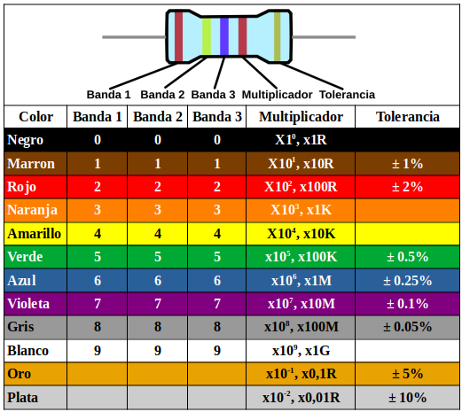
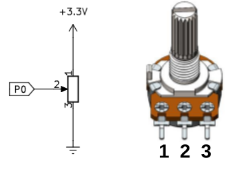
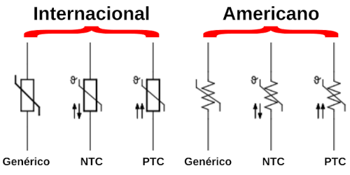
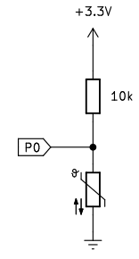
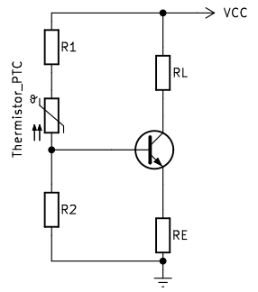

# Resistencias
La resistencia eléctrica es la oposición o dificultad que un circuito ofrece al paso de la corriente eléctrica. Cuanto mas se opone el elemento mayor es su resistencia.

Para su representación en circuito se utilizan los śimbolos siguientes:

  
*Símbolos de resistencia*

La resistencia se relaciona con otras magnitudes eléctricas a través de la [ley de Ohm](../apartados/ohm.md).

La resistencia de un conductor, cuando se trata de longitudes de conductor largas, no se puede calcular por la ley de Ohm, aplicandose la siguiente ecuación:

$R = \rho \dfrac{l}{S}$

Donde:

* [ ] - $\rho$ es la resistividad del conductor expresada en $\Omega \cdot m$. La resistividad de algunos materiales la podemos encontrar en el enlace al artículo [Resistividad](https://es.wikipedia.org/wiki/Resistividad) de la wikipedia.
* [ ] - $l$ es la longitud del conductor expresada en metros.
* [ ] - $S$ es la sección del conductor expresada en $mm^2$.

Los materiales cambian el valor de su resistividad con la temperatura y dicha variación queda expresada por:

$R_{t^o} = R_0 (1 + \alpha \cdot \Delta T^o)$

Donde:

* [ ] - $R_{T^o}$ es la resistencia a la temperatura T (caliente).
* [ ] - $R_0$ es la resistencia a 20ºC o una temperatura dada.
* [ ] - $\alpha$ es el coeficiente de temperatura a 20ºC o una temperatura dada.
* [ ] - $\Delta T^o$ es el incremento de temperatura en grados centígrados.

## **Resistencias fijas**
La resistencia es un componente electrónico del grupo denominado 'pasivos' que está diseñado para oponerse al paso de la corriente. El valor de la resistencia se expresa en ohmios o sus múltiplos. Se fabrican principalmente de carbón (la mina de un lápiz es una resistencia) o de pelicula metálica y se comercializan en una amplia gama de valores. Su aspecto lo vemos en la imagen.

  
*Resistencias*

Las resistencias están definidas por tres características fundamentales:

- su valor resistivo
- la potencia máxima que puede disipar
- la tolerancia

Hay resistencias con valores de Ohmios (Ω), Kilohmios (KΩ), Megaohmios (MΩ) y otros múltiplos y submúltiplos. La equivalencias entre ellas es:

* 1 Kilohmio (KΩ) = 1,000 Ohmios (Ω)
* 1 Megaohmio (MΩ) = 1,000,000 Ohmios (Ω) = 1,000 Kilohmios (KΩ)

Para poder saber que valor y tolerancia tiene una resistencia, existe un código de colores que nos ayuda a obtener con facilidad estos valores. La potencia no se indica expresamente en este tipo de resistencias y depende de su tamaño, por lo que con el uso nos iremos acostumbrando.

Existen resistencia de 3 (en desuso), 4, 5 y 6 bandas de colores y cada una se lee de manera diferente aunque parecida.

Existen muchas páginas y aplicaciones que nos ayudan a averiguar el valor de una resistencia por sus bandas de color. Una muy completa y fácil de usar es la de [Digikey](https://www.digikey.es/es/resources/conversion-calculators/conversion-calculator-resistor-color-code), una tienda de componentes que además nos ofrece otras muchas calculadoras que nos resultarán útiles. En la imagen vemos el resultado para una resistencia de 5 bandas de 220 ohmios.

  
*Valor de resistencia*

En la imagen siguiente vemos las instrucciones y el diagrama para obtener el valor resistivo a partir de las bandas de color.

  
*Código de colores de resistencias*

### 4 bandas
En estas, una de las bandas estará más cercana al terminal o patilla, puede ser mas ancha y es esa su primera cifra significativa o banda 1, la siguiente es la banda 2, la siguiente es la banda multiplicadora y la cuarta banda es la banda de tolerancia, esta banda normalmente es mas estrecha. A continuación vemos como se leen estas resistencias.

  
*Resistencias de cuatro bandas*

El valor se obtendría poniendo: 56 x 10⁴ = 560k +/- 5%

### 5 bandas
En este caso hay tres cifras significativas y se leen como vemos a continuación.

  
*Resistencias de cinco bandas*

El valor se obtendría poniendo: 247 x 10² = 24700 = 24K7 +/- 5%

### 6 bandas
A estas resistencias se añade una sexta banda como última banda para indicar el coeficiente de temperatura y también tienen tres cifras signiticativas. A continuación vemos como se leen. El coeficiente de temperatura indica cuanto cambia el valor de la resistencia en función de la temperatura utilizando normalmente ppm/K (partes por millón por grado Kelvin) como unidad. Es muy raro ver resistencias de seis bandas como componente habitual.

  
*Resistencias de seis bandas*

El valor se obtendría poniendo: 412 x 10³ = 412K +/- 1% y 5 ppm/K

## **El potenciómetro**
Se trata de un tipo de resistencia en la que es posible cambiar su valor. Es un dispositivo que normalmente tiene tres terminales. Un potenciómetro suele estar formado por un material resistivo (un hilo de cobre u otro material conductor o un elemento de carbón) y una escobilla (denominada cursor) de contacto móvil. Cuando el cursor se desplaza a lo largo del elemento resistivo, se produce un cambio en la resistencia entre el terminal unido a este y los terminales extremos que es entre los que está la resistencia total fija característica del potenciómetro.

  
*Conexión habitual del potenciómetro*

En la imagen siguiente vemos el aspecto de un modelo concreto de potenciómetro así como los símbolos habituales del mismo. La numeración indica lo siguiente:

* Terminales 1 y 3 son los contactos unidos a los extremos de la resistencia fija o resistencia total del potenciómetro.
* Terminal 2 es el contacto que va unido al cursor o parte móvil que se desliza sobre la resistencia fija haciendo que la resistencia entre un terminal y el cursor varíe en función de la posición de este.

  
*Aspecto y símbolo del potenciómetro*

La posición del cursor se determina de forma mecánica y son adecuados para usarlos como elementos de control de tensión (conexión en serie) o de corriente (conexión en paralelo). Los potenciómetros del tipo que estamos viendo (existen de otros muchos tipos) tienen un funcionamiento en forma de rotación con un ángulo de unos 270 grados entre los puntos mas extremos.

## **Resistencia LDR**
Existe también un tipo de resistencia especial denominado fotoresistencia o fotoresistor que es un componente electrónico cuya resistencia disminuye de forma exponencial con el aumento de la intensidad de luz incidente. Las siglas LDR vienen de su nombre en inglés, que es Light Dependent Resistor. En la imagen siguiente tenemos el símbolo, el aspecto real de una LDR y su curva característica de variación de resistencia con la iluminación.

  
*Símbolo, aspecto y curva característica de la LDR*

La resistencia de una LDR varia en proporción a la luz ambiental detectada. Con esta característica, podemos utilizar una LDR para detectar la intensidad de la luz.

A continuación vemos los circuitos que se utilizan para detectar el cambio del valor de resistencia de una LDR cuando la conectamos a una placa:

  
*Circuitos para detectar variaciones de R en la LDR*

En estos circuitos, cuando el valor de la resistencia de la LDR cambia debido a un cambio en la intensidad de la luz, las tensiones en la LDR y la resistencia fija también cambiarán. Podemos hacer que el valor de la intensidad de la luz se corresponda con esa tensión.

## **El termistor**
El termistor (contracción de térmico y resistor) es una resistencia sensible a la temperatura, es decir, que cuando se produce un cambio de temperatura, la resistencia del termistor varía. Normalmene tiene forma de pequeña gota o perla, disco tipo lenteja o un cilindro encapsulado.

Hay dos tipos de termistores, los que tienen un Coeficiente de Temperatura Negativo (NTC) y lo que tienen un Coeficiente de Temperatura Positivo (PTC). En un termistor NTC cuando la temperatura aumenta su resistencia disminuye y a la inversa, cuando baja la temperatura su resistencia aumenta. Esta característica la podemos aprovechar para medir temperaturas.

En un termistor PTC cuando aumenta la temperatura lo hace su resistencia y cuando disminuy la temperatura también lo hace su resistencia. Este tipo de termistor se usa principalmente como fusible térmico.

El símbolo de un termistor es:

  
*Símbolo usuales del termistor*

Existen muchas y variadas formas de encapsulados de termistores y en la [Wikipedia](https://es.wikipedia.org/wiki/Termistor) aparecen clasificados por su forma.

  
*Encapsulados de los termistores*

La curva característica de un termistor NTC es la siguiente:

  
*Curva Resistencia/Temperatura termistor NTC*

La ecuación que relaciona el valor de resistencia y la temperatura es:

$R = R_0 \cdot e^{\beta \cdot (\dfrac{1}{T} -\dfrac{1}{T_0})}$

Donde:

* R es la resistencia a temperatura ambiente T
* $R_0$ es la resistencia a la temperatura ambiente $T_0$
* $\beta$ es la constante del termistor

La constate $\beta$ viene dada por:

$\beta = \ln\dfrac{\dfrac{R}{R_0}}{\dfrac{1}{T}-\dfrac{1}{T_0}}$

Los valores de resistencia nominal dados a 25ºC para termistores comerciales habituales son de 1K, 10K y 100K, aunque existen de otro valores.

El esquema de conexionado mas sencillo de un termistor es como el siguiente:

  
*Esquema base de conexionado de un termistor NTC*

En ese circuito es muy fácil saber el valor de la tensión en P0, ya que por teoría del divisor de tensión tenemos que:

$V_{P_0} = 3.3 \cdot\dfrac{R_t}{R+R_t} \Rightarrow R_t = \dfrac{R}{\dfrac{3.3}{V_{P_0}}-1}$

Podemos utilizar el valor analógico medido en el pin P0 para obtener el valor de resistencia del termistor poder obtener la temperatura a partir de la ecuación:

$T = (\dfrac{1}{T_0}+\dfrac{\ln(\dfrac{R}{R_0})}{\beta})^{-1}$

El rango de temperatura en la que el termistor tiene un comportamiento muy estable y de gran sensibilidad se sitúa en torno a los 50ºC sobre una temperatura central. Otras ventajas de este tipo de termistores es que son muy económicos y que tienen un durabilidad muy alta. Sus principales desventajas son que no tienen un comportamiento lineal, su tiempo de respuesta es relativamente lento (entre 7 y 10 segundos) y su rango de temperatura es limitado.

Un ejemplo de termistor NTC es el del [datasheet](https://www.rinconingenieril.es/wp-content/uploads/2017/08/NTC_Vishay.pdf) en el que el fabricante nos suministra los valores de $R_0, \space T_0 \space y \space \beta$. En la tabla extraida del datasheet podemos ver estos datos para distintas resistencias, en nuestro caso trabajamos con una que con $T_0 = 25ºC, \space R_0 = 10K \space y \space \beta = 3977$

La curva característica de un termistor PTC es la siguiente:

  
*Curva Resistencia/Temperatura termistor PTC*

El circuito típico de aplicación de un termistor PTC es el siguiente:

  
*Esquema base de conexionado de un termistor PTC*

Los termistores tienen diversas utilizaciones y algunas de ellas pueden ser:

* Control de temperatura de extrusor y cama caliente en impresoras 3D de fusión de material.
* Termostatos.
* Control de temperatura de aceite en automóviles.
* Control de temperatura en frigorificos y hornos.
* Protección contra sobretensiones.
* Control de temperatura en la carga de baterias.
