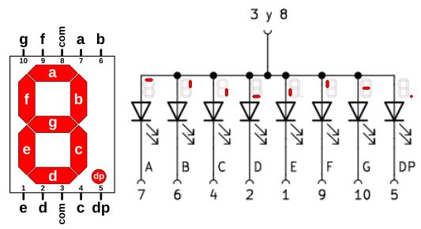

# Semiconductores discretos

## **El diodo semiconductor**
Son dispositivos que permiten el paso de la corriente electrica en un solo sentido y la bloquean en el contrario. Se suelen conocer también como rectificadores por su capacidad de convertir la corriente alterna en corriente continua pulsatoria. Existen diferentes tipos de diodos y nos centraremos en describir como funcionan los diodos de estado sólido sin entrar en demasiados fundamentos científicos. El símbolo del diodo es un triángulo que viene a indicar el sentido permitido de circulación de corriente y la barrera que se opone en el contrario.

  
*Símbolo usuales del diodo*

El funcionamiento del diodo se basa en su construcción y esta se realiza mediante la unión de dos materiales semiconductores de un determinado tipo (normalmente silicio) dopados de forma controlada con carga de electrones (zona de tipo N) y otra con carga de protones o huecos o ausencia de electrones (zona de tipo P). Esto crea una unión PN en la que la zona tipo N recibe el nombre de cátodo (K) y la zona de tipo P de ánodo (A). Polarizando directamente la unión se reduce la barrera de la unión facilitando el paso de la corriente y si se polariza inversamente ocurre lo contrario y se impide la circulación de corriente.

  
*Funcionamiento esquematizado de un diodo*

Los tipos de diodos se caracterizan de manera básica por los materiales con los que están fabricados y por la cantidad de impurezas dopantes. Entre otros nos podemos encontrar con:

* **Laser**. Son capaces de generar un rayo de luz laser con una longitud de onda entre 800 y 850 nanómetros. Se aplica en fibra óptica, punteros laser, lectores de código de barras, etc.
* **Zener**. Están diseñados para trabajar en polarización inversa de forma que al alcanzar un determinado nivel de tensión inversa (tensión zener) comienza a conducir manteniendo practicamente constante esa tensión de ruptura zener. Su aplicación fundamental está en los reguladores de tensión constante.
* **Schottky**. Debe el nombre a su inventor [Walter Schottky](https://es.wikipedia.org/wiki/Walter_H._Schottky) y se conoce también como diodo de conmutación rápida, ya que esta es su principal característica. Esta rapidez es posible porque son sufientes 0.3V de diferencia de tensión para que se produzca el cambio de conducción. Tienen aplicación allí donde son necesarias las altas velocidades de conmutación.
* **LED**. Basan su funcionamiento en la generación de fotones por recombinación de los portadores de cargas. Existen de diversos colores y se aplican en muchos sitios diferentes. En el apartado siguiente se explica algo mas de los mismos.
* **Shockley**. No confundir con ***Schottky***. Está formado por cuatro capas alternando zonas P y N, lo que lo convierten básicamente en un tipo de tiristor. Su funcionamiento se basa en pasar de un estado de baja impedancia (conducción) a otro de alta impedancia (corte) por disminución de la tensión con el consiguiente aumento de corriente. A la inversa se pasa de saturación a corte. El invento es debido al físico [William Shockley](https://es.wikipedia.org/wiki/William_Bradford_Shockley) uno de los descubridores del transistor.

La simbología de los diferentes diodos gira en torno a variaciones del símbolo fundamental visto. En la entrada [Símbolo electrónico
](https://es.wikipedia.org/wiki/S%C3%ADmbolo_electr%C3%B3nico) se pueden consultar junto con los de otros muchos componentes.

En la infografia [Funcionamiento y polarización del diodo semiconductor](../img/apartados/semi_disc/infograf_func_diodo.svg) tenemos un resumen de sus características tensión/corriente y su funcionamiento. [La infografía](../img/apartados/semi_disc/infograf_func_diodo.pdf) como archivo en formato pdf. A continuación vemos la imagen de esta infografia.

  
*Funcionamiento y polarización del diodo semiconductor*

## **Diodo LED y elementos con LEDs**
El diodo LED (Light Emitting Diode) es un diodo semiconductor capaz de emitir luz, lo mas usuales dentro del espectro visible aunque también pueden ser de infrarrojos, laser, etc. Su uso mas habitual es como indicador y, últimamente cada vez mas frecuentes en iluminación. Sus principales ventajas frente a luces incandescentes son:

* Menor consumo de energía
* Mayor vida útil
* Menor tamaño
* Gran durabilidad y fiabilidad
* En la imagen siguiente vemos el aspecto físico que tiene y su símbolo electrónico.

  
*Aspecto y símbolo del LED*

El color de la cápsula es simplemente orientativo, es la longitud de onda quien define realmente el color de la luz emitida. Por ello el LED con la cápsula transparente puede emitir en cualquiera de los colores del espectro visible.

La forma de la capsula mas habitual es cilíndrica de 3 o 5 mm de diámetro, aunque existen otras formas menos usuales como las que vemos en la imagen siguiente:

  
*Tipos de encapsulados para LEDs*

El LED es un dispositivo que tiene polaridad siendo su comportamiento el siguiente: En polarización directa (ánodo a positivo y cátodo a negativo) el LED emite luz y en polarización inversa (ánodo negativo y cátodo positivo) se comporta prácticamente como un interruptor abierto.

Para su correcto funcionamiento el diodo LED se polariza poniéndole en serie una resistencia que limita la corriente que pasa a través del mismo y, por tanto, determina el nivel de brillo de la luz emitida.

Sin entrar en detalles en la tabla siguiente se dan los valores de tensión directa (VF) y corriente directa (IF) para los colores mas habituales de LEDs. A partir de estos valores y el valor de tensión de alimentación de nuestro LED podemos calcular el valor de la resistencia serie sin mas que aplicar la formula indicada.

  
*Tensión y corriente para distintos colores*

La formula corresponde a un circuito típico de polarización de un diodo LED como el siguiente:

  
*Circuito de polarización de un LED*

Si tenemos necesidad podemos utilizar la [calculadora de resistencia serie LED](https://www.digikey.es/es/resources/conversion-calculators/conversion-calculator-led-series-resistor) de Kigikey.

### Barras de LEDs
Estas matrices de LED pueden tener distinto número de elementos y están diseñadas para mostrar información en forma de gráfico de barras fácilmente reconocible. Los elementos suelen ser acoplables por los extremos y, por tanto, tienen capacidad de extensión. El uso de estas matrices de gráficos de barras elimina los problemas de alineación, intensidad y coincidencia de colores asociados a los LED discretos. Existen modelos en que todos los LEDs son del mismo color y existen otros en los que cada LED es de un color diferente, por ejemplo rojos, amarillos y verdes. En definitiva son LED individuales dispuestos en el encapsulado en forma de barra.

Normalmente un barra tiene 10 LEDs integrados en un mismo encapsulado con dos filas de pines que permiten manejarlos como LEDs individuales. En la imagen vemos su aspecto real y el diagrama de pines.

  
*Aspecto real y diagrama de pines de barra de 10 LEDs*

Dependiendo del fabricante tendremos disponibilidad de mas datos sobre nuestra barra concreta o no, entre ellos la posibilidad de identificar los pines como ánodo o como cátodo.

### LED RGB
Un LED RGB es en realidad un encapsulado que incorpora tres diodos LED, uno por cada color fundamental y una patilla común que puede ser el ánodo o el cátodo de los tres diodos.

Los colores primarios en óptica son el rojo, el verde y el azul y la correcta combinación, en términos de intensidad, de ellos originará cualquiera de los colores secundarios. Las siglas RGB son el acrónimo de Red, Green y Blue. En la imagen siguiente vemos el modelo aditivo de los colores rojo, verde y azul.

  
*RGB*   
*Imagen obtenida de [Wikipedia](https://es.wikipedia.org/wiki/RGB)*

Existen dos tipos de LEDs RGB según están conectados internamente y pueden ser de cátodo común o de ánodo común. El símbolo y la representación de este componente lo vemos en la imagen siguiente, correspondiendo la pareja de la izquierda a los de cátodo común y la pareja de la derecha a los de ánodo común:

  
*Símbolo y representación LED RGB*

El pin mas largo es el común, el de su izquierda es el rojo (R), el de su derecha es el verde (G) y el último por la derecha el azul (B).

Teóricamente, cada uno de los LEDs podría adoptar 256 (valores entre 0 y 255) colores diferentes, es decir, un total de 16.777.216 (256x3) posibles colores diferentes con un LED RGB. En realidad el ojo humano solamente puede ver unos 10 millones de colores definidos por lo que se conoce como **espacio de color**, que tiene como referencia estándar habitual el **espacio de color** el denominado **CIELAB** o **CIEXYZ**, diseñados especificamente para abarcar lo que el ojo humano ve.

### Display de siete segmentos
Son diodos LEDs encapsulados en una disposición en forma de 8 e interconectados entre si de una forma predeterminada que veremos a continuación. La denominación de segmento hay que atribuirla a que cuando se ilumina cada LED se destaca su segmento que forma parte del dígito que se muestra. Normalmente incorporan un octavo LED situado en forma de punto en la parte inferior derecha del dispositivo y que actuará como punto decimal (DP, de Decimal Point) en caso de conectar dos o mas displays de 7 segmentos.

  
*Aspecto de displays de 7 segmentos*

Los pines de estos dispositivos (nos referimos al de un elemento) se nombran y distribuyen de la forma siguiente:

  
*Asociación de pines y segmentos*

Entre la patilla común y cada letra hay conectado un LED de manera que todos sus cátodos, o bien todos sus ánodos van a esa patilla común. El pin común se utiliza para indicar el tipo de display que serán de cátodo común (CC) o de ánodo común (CA). En la figura siguiente vemos el circuito de cada uno de los tipos.

  
*Esquemas circuitos internos displays 7 segmentos*

Polarizando adecuadamente cada segmento con su resistencia limitadora podemos activar o desactivar el encendido de cada LED y así formar números y caracteres. En la tabla siguiente podemos ver los números base del sistema decimal y su relación con los segmentos que deben encenderse.

|Dígito|a|b|c|d|e|f|g|
|:|:|:|:|:|:|:|:|
| |1|1|1|1|1|1|0|
| |0|1|1|0|0|0|0|
| |1|1|0|1|1|0|1|
| |1|1|1|1|0|0|1|
| |0|1|1|0|0|1|1|
| |1|0|1|1|0|1|1|
| |1|0|1|1|1|1|1|
| |1|1|1|0|0|0|0|
| |1|1|1|1|1|1|1|
| |1|1|1|1|0|1|1|

Es evidente que conectando los segmentos a pines de la placa a través de la correspondiente resistencia podríamos programar su encendido tal y como se ha reflejado en la tabla, incluso aumentando los caracteres hasta 16 para tener el sistema hexadecimal. Pero esto evidentemente va a resultar muy poco práctico. En la vida real existen decodificadores especializados en realizar esta tarea que utilizan menos entradas (4) para realizar la decodificación. Ejemplos de estos decodificadores son el 7447 en tecnología TTL y el 4511 en tecnología CMOS.

### Control de display de 7-seg con registro de desplazamiento
Un display de 7 segmentos es un dispositivo electrónico de visualización digital el el que se representa la cifra "8" y un punto decimal. Consta de LEDs que pueden estar conectados en configuración de ánodo común (el que usaremos en las actividades) o aátodo Común. Su estructura interna y diagrama de designación de pines se muestra a continuación, donde podemos observar el segmento que le corresponde a cada pin.

  
*Diagrama interno y designación de pines en un displays 7 segmentos*

Como podemos ver en el diagrama del circuito anterior, es posible controlar el estado de cada LED por separado y mostrar diferentes números y caracteres.

Los 8 LEDs se pueden representar mediante un byte que permitirá mostrar el estado de los LEDs que están conectados a los pines 5, 10, 9, 1, 2, 4, 6, 7. Vamos a usar 0 para representar el estado de encendido y 1 para el estado de apagado. Entonces el número 0 se puede expresar como un número binario 11000000, o su equivalente en hexadecimal 0xC0.

En la tabla que vemos a continuación se muestran los números y letras que se pueden mostrar y su equivalentes en distintos sistemas de numeración.

|Número/letra|Binario|Hexadecimal|Decimal|
|:-:|:-:|:-:|:-:|
|0|11000000|0xC0|192|
|1|11111001|0xF9|249|
|2|10100100|0xA4|164|
|3|10110000|0xB0|176|
|4|10011001|0x99|153|
|5|10010010|0x92|146|
|6|10000010|0x82|130|
|7|11111000|0xF8|248|
|8|10000000|0x80|128|
|9|10010000|0x90|144|
|A|10001000|0x88|136|
|b|10000011|0x83|131|
|C|11000110|0xC6|198|
|d|10100001|0xA1|161|
|E|10000110|0x86|134|
|F|10001110|0x8E|142|

Un esquema como el siguiente nos va a permitir conectar diodos LEDs al registro de desplazamiento 74HC595 para entrar datos en serie y activar los diodos LEDs en paralelo.

  
*Control de diodos LEDs mediante 74HC595*

