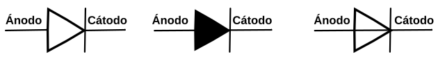
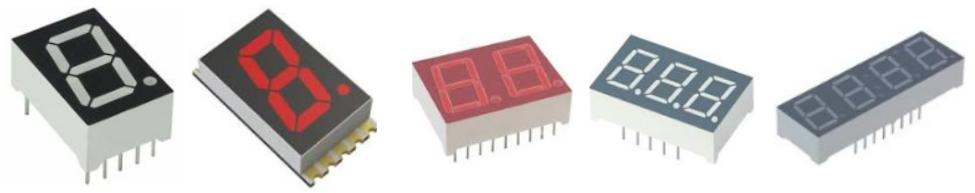
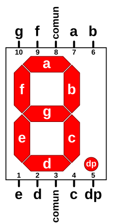
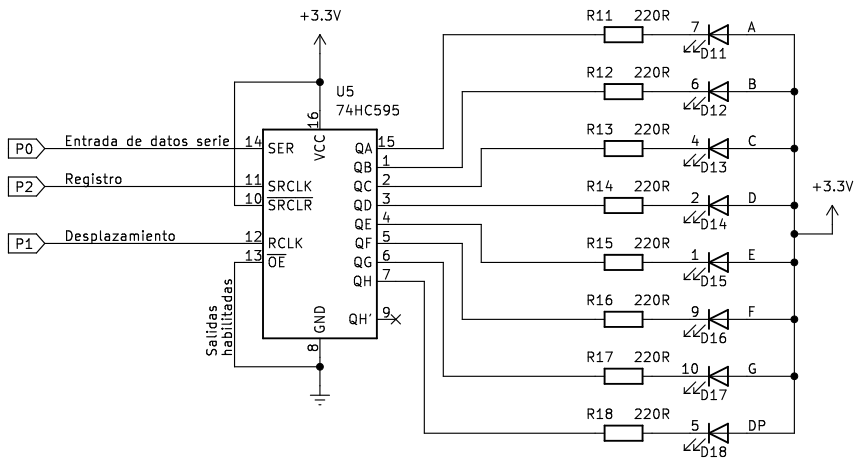
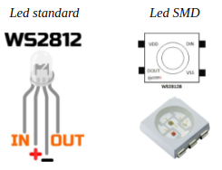
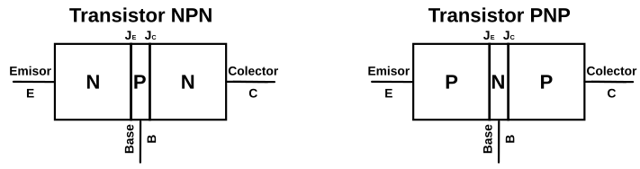
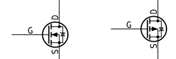

# Semiconductores discretos

## **El diodo semiconductor**
Son dispositivos que permiten el paso de la corriente electrica en un solo sentido y la bloquean en el contrario. Se suelen conocer también como rectificadores por su capacidad de convertir la corriente alterna en corriente continua pulsatoria. Existen diferentes tipos de diodos y nos centraremos en describir como funcionan los diodos de estado sólido sin entrar en demasiados fundamentos científicos. El símbolo del diodo es un triángulo que viene a indicar el sentido permitido de circulación de corriente y la barrera que se opone en el contrario.

  
*Símbolo usuales del diodo*

El funcionamiento del diodo se basa en su construcción y esta se realiza mediante la unión de dos materiales semiconductores de un determinado tipo (normalmente silicio) dopados de forma controlada con carga de electrones (zona de tipo N) y otra con carga de protones o huecos o ausencia de electrones (zona de tipo P). Esto crea una unión PN en la que la zona tipo N recibe el nombre de cátodo (K) y la zona de tipo P de ánodo (A). Polarizando directamente la unión se reduce la barrera de la unión facilitando el paso de la corriente y si se polariza inversamente ocurre lo contrario y se impide la circulación de corriente.

  
*Funcionamiento esquematizado de un diodo*

Los tipos de diodos se caracterizan de manera básica por los materiales con los que están fabricados y por la cantidad de impurezas dopantes. Entre otros nos podemos encontrar con:

* **Laser**. Son capaces de generar un rayo de luz laser con una longitud de onda entre 800 y 850 nanómetros. Se aplica en fibra óptica, punteros laser, lectores de código de barras, etc.
* **Zener**. Están diseñados para trabajar en polarización inversa de forma que al alcanzar un determinado nivel de tensión inversa (tensión zener) comienza a conducir manteniendo practicamente constante esa tensión de ruptura zener. Su aplicación fundamental está en los reguladores de tensión constante.
* **Schottky**. Debe el nombre a su inventor [Walter Schottky](https://es.wikipedia.org/wiki/Walter_H._Schottky) y se conoce también como diodo de conmutación rápida, ya que esta es su principal característica. Esta rapidez es posible porque son sufientes 0.3V de diferencia de tensión para que se produzca el cambio de conducción. Tienen aplicación allí donde son necesarias las altas velocidades de conmutación.
* **LED**. Basan su funcionamiento en la generación de fotones por recombinación de los portadores de cargas. Existen de diversos colores y se aplican en muchos sitios diferentes. En el apartado siguiente se explica algo mas de los mismos.
* **Shockley**. No confundir con ***Schottky***. Está formado por cuatro capas alternando zonas P y N, lo que lo convierten básicamente en un tipo de tiristor. Su funcionamiento se basa en pasar de un estado de baja impedancia (conducción) a otro de alta impedancia (corte) por disminución de la tensión con el consiguiente aumento de corriente. A la inversa se pasa de saturación a corte. El invento es debido al físico [William Shockley](https://es.wikipedia.org/wiki/William_Bradford_Shockley) uno de los descubridores del transistor.

La simbología de los diferentes diodos gira en torno a variaciones del símbolo fundamental visto. En la entrada [Símbolo electrónico
](https://es.wikipedia.org/wiki/S%C3%ADmbolo_electr%C3%B3nico) se pueden consultar junto con los de otros muchos componentes.

En la infografia [Funcionamiento y polarización del diodo semiconductor](../img/apartados/semi_disc/infograf_func_diodo.svg) tenemos un resumen de sus características tensión/corriente y su funcionamiento. [La infografía](../img/apartados/semi_disc/infograf_func_diodo.pdf) como archivo en formato pdf. A continuación vemos la imagen de esta infografia.

  
*Funcionamiento y polarización del diodo semiconductor*

## **Diodo LED y elementos con LEDs**
El diodo LED (Light Emitting Diode) es un diodo semiconductor capaz de emitir luz, lo mas usuales dentro del espectro visible aunque también pueden ser de infrarrojos, laser, etc. Su uso mas habitual es como indicador y, últimamente cada vez mas frecuentes en iluminación. Sus principales ventajas frente a luces incandescentes son:

* Menor consumo de energía
* Mayor vida útil
* Menor tamaño
* Gran durabilidad y fiabilidad
* En la imagen siguiente vemos el aspecto físico que tiene y su símbolo electrónico.

  
*Aspecto y símbolo del LED*

El color de la cápsula es simplemente orientativo, es la longitud de onda quien define realmente el color de la luz emitida. Por ello el LED con la cápsula transparente puede emitir en cualquiera de los colores del espectro visible.

La forma de la capsula mas habitual es cilíndrica de 3 o 5 mm de diámetro, aunque existen otras formas menos usuales como las que vemos en la imagen siguiente:

  
*Tipos de encapsulados para LEDs*

El LED es un dispositivo que tiene polaridad siendo su comportamiento el siguiente: En polarización directa (ánodo a positivo y cátodo a negativo) el LED emite luz y en polarización inversa (ánodo negativo y cátodo positivo) se comporta prácticamente como un interruptor abierto.

Para su correcto funcionamiento el diodo LED se polariza poniéndole en serie una resistencia que limita la corriente que pasa a través del mismo y, por tanto, determina el nivel de brillo de la luz emitida.

Sin entrar en detalles en la tabla siguiente se dan los valores de tensión directa (VF) y corriente directa (IF) para los colores mas habituales de LEDs. A partir de estos valores y el valor de tensión de alimentación de nuestro LED podemos calcular el valor de la resistencia serie sin mas que aplicar la formula indicada.

  
*Tensión y corriente para distintos colores*

La formula corresponde a un circuito típico de polarización de un diodo LED como el siguiente:

  
*Circuito de polarización de un LED*

Si tenemos necesidad podemos utilizar la [calculadora de resistencia serie LED](https://www.digikey.es/es/resources/conversion-calculators/conversion-calculator-led-series-resistor) de Kigikey.

### Barras de LEDs
Estas matrices de LED pueden tener distinto número de elementos y están diseñadas para mostrar información en forma de gráfico de barras fácilmente reconocible. Los elementos suelen ser acoplables por los extremos y, por tanto, tienen capacidad de extensión. El uso de estas matrices de gráficos de barras elimina los problemas de alineación, intensidad y coincidencia de colores asociados a los LED discretos. Existen modelos en que todos los LEDs son del mismo color y existen otros en los que cada LED es de un color diferente, por ejemplo rojos, amarillos y verdes. En definitiva son LED individuales dispuestos en el encapsulado en forma de barra.

Normalmente un barra tiene 10 LEDs integrados en un mismo encapsulado con dos filas de pines que permiten manejarlos como LEDs individuales. En la imagen vemos su aspecto real y el diagrama de pines.

  
*Aspecto real y diagrama de pines de barra de 10 LEDs*

Dependiendo del fabricante tendremos disponibilidad de mas datos sobre nuestra barra concreta o no, entre ellos la posibilidad de identificar los pines como ánodo o como cátodo.

### LED RGB
Un LED RGB es en realidad un encapsulado que incorpora tres diodos LED, uno por cada color fundamental y una patilla común que puede ser el ánodo o el cátodo de los tres diodos.

Los colores primarios en óptica son el rojo, el verde y el azul y la correcta combinación, en términos de intensidad, de ellos originará cualquiera de los colores secundarios. Las siglas RGB son el acrónimo de Red, Green y Blue. En la imagen siguiente vemos el modelo aditivo de los colores rojo, verde y azul.

  
*RGB*   
*Imagen obtenida de [Wikipedia](https://es.wikipedia.org/wiki/RGB)*

Existen dos tipos de LEDs RGB según están conectados internamente y pueden ser de cátodo común o de ánodo común. El símbolo y la representación de este componente lo vemos en la imagen siguiente, correspondiendo la pareja de la izquierda a los de cátodo común y la pareja de la derecha a los de ánodo común:

  
*Símbolo y representación LED RGB*

El pin mas largo es el común, el de su izquierda es el rojo (R), el de su derecha es el verde (G) y el último por la derecha el azul (B).

Teóricamente, cada uno de los LEDs podría adoptar 256 (valores entre 0 y 255) colores diferentes, es decir, un total de 16.777.216 (256x3) posibles colores diferentes con un LED RGB. En realidad el ojo humano solamente puede ver unos 10 millones de colores definidos por lo que se conoce como **espacio de color**, que tiene como referencia estándar habitual el **espacio de color** el denominado **CIELAB** o **CIEXYZ**, diseñados especificamente para abarcar lo que el ojo humano ve.

### Display de siete segmentos
Son diodos LEDs encapsulados en una disposición en forma de 8 e interconectados entre si de una forma predeterminada que veremos a continuación. La denominación de segmento hay que atribuirla a que cuando se ilumina cada LED se destaca su segmento que forma parte del dígito que se muestra. Normalmente incorporan un octavo LED situado en forma de punto en la parte inferior derecha del dispositivo y que actuará como punto decimal (DP, de Decimal Point) en caso de conectar dos o mas displays de 7 segmentos.

  
*Aspecto de displays de 7 segmentos*

Los pines de estos dispositivos (nos referimos al de un elemento) se nombran y distribuyen de la forma siguiente:

  
*Asociación de pines y segmentos*

Entre la patilla común y cada letra hay conectado un LED de manera que todos sus cátodos, o bien todos sus ánodos van a esa patilla común. El pin común se utiliza para indicar el tipo de display que serán de cátodo común (CC) o de ánodo común (CA). En la figura siguiente vemos el circuito de cada uno de los tipos.

  
*Esquemas circuitos internos displays 7 segmentos*

Polarizando adecuadamente cada segmento con su resistencia limitadora podemos activar o desactivar el encendido de cada LED y así formar números y caracteres. En la tabla siguiente podemos ver los números base del sistema decimal y su relación con los segmentos que deben encenderse.

|Dígito|a|b|c|d|e|f|g|
|:|:|:|:|:|:|:|:|
| |1|1|1|1|1|1|0|
| |0|1|1|0|0|0|0|
| |1|1|0|1|1|0|1|
| |1|1|1|1|0|0|1|
| |0|1|1|0|0|1|1|
| |1|0|1|1|0|1|1|
| |1|0|1|1|1|1|1|
| |1|1|1|0|0|0|0|
| |1|1|1|1|1|1|1|
| |1|1|1|1|0|1|1|

Es evidente que conectando los segmentos a pines de la placa a través de la correspondiente resistencia podríamos programar su encendido tal y como se ha reflejado en la tabla, incluso aumentando los caracteres hasta 16 para tener el sistema hexadecimal. Pero esto evidentemente va a resultar muy poco práctico. En la vida real existen decodificadores especializados en realizar esta tarea que utilizan menos entradas (4) para realizar la decodificación. Ejemplos de estos decodificadores son el 7447 en tecnología TTL y el 4511 en tecnología CMOS.

### Control de display de 7-seg con registro de desplazamiento
Un display de 7 segmentos es un dispositivo electrónico de visualización digital el el que se representa la cifra "8" y un punto decimal. Consta de LEDs que pueden estar conectados en configuración de ánodo común (el que usaremos en las actividades) o aátodo Común. Su estructura interna y diagrama de designación de pines se muestra a continuación, donde podemos observar el segmento que le corresponde a cada pin.

  
*Diagrama interno y designación de pines en un displays 7 segmentos*

Como podemos ver en el diagrama del circuito anterior, es posible controlar el estado de cada LED por separado y mostrar diferentes números y caracteres.

Los 8 LEDs se pueden representar mediante un byte que permitirá mostrar el estado de los LEDs que están conectados a los pines 5, 10, 9, 1, 2, 4, 6, 7. Vamos a usar 0 para representar el estado de encendido y 1 para el estado de apagado. Entonces el número 0 se puede expresar como un número binario 11000000, o su equivalente en hexadecimal 0xC0.

En la tabla que vemos a continuación se muestran los números y letras que se pueden mostrar y su equivalentes en distintos sistemas de numeración.

|Número/letra|Binario|Hexadecimal|Decimal|
|:-:|:-:|:-:|:-:|
|0|11000000|0xC0|192|
|1|11111001|0xF9|249|
|2|10100100|0xA4|164|
|3|10110000|0xB0|176|
|4|10011001|0x99|153|
|5|10010010|0x92|146|
|6|10000010|0x82|130|
|7|11111000|0xF8|248|
|8|10000000|0x80|128|
|9|10010000|0x90|144|
|A|10001000|0x88|136|
|b|10000011|0x83|131|
|C|11000110|0xC6|198|
|d|10100001|0xA1|161|
|E|10000110|0x86|134|
|F|10001110|0x8E|142|

Un esquema como el siguiente nos va a permitir conectar diodos LEDs al registro de desplazamiento 74HC595 para entrar datos en serie y activar los diodos LEDs en paralelo.

  
*Control de diodos LEDs mediante 74HC595*

## LED RGB direccionable
Comúnmente se les conoce como Neopixel, que es una marca registrada por [Adafruit Industries](https://www.adafruit.com/). Cada LED que componen la tira o matriz tiene los siguientes cuatro pines:

* Alimentación VDD: 5V
* Tierra: GND
* DI (Date Input): pin para recibir información
* DO (Date Output): pin para enviar inforamción

Cada uno de los LEDs es direccionable de manera individual gracias al circuito electrónico que incluyen que es un circuito lógico con una memoria de un byte por color. Los tipos mas comunes son el SK6812, WS2811 o, el mas habitual de todos, el WS2812 cuyo [datasheet](./datasheet/WS2812.pdf) tenemos en el enlace.

El WS2812B incluye un oscilador interno de precisión y un circuito de control de corriente constante programable de 12 V, lo que garantiza de manera efectiva que la intensidad del color sea consistente. El protocolo de transferencia de datos utiliza un único modo de comunicación de multiplexado NZR.

En la figura siguiente vemos el aspecto de un diodo LED RGB individual en formato inserción y SMD.

  
*Aspecto de un diodo LED RGB direccionable*

### **Aspectos previos**
Para transmitir información digital esta se debe sincronizar mediante una convención especial, la codificación. Dos dispositivos llevan una comunicación por cable convirtiendo la información a transmitir en un flujo de bits (0 y 1) o "Dates" que se suele nombrar con la letra D y que va acompañada de una señal de reloj para sincronizar las transmisiones. La forma convencional de transmisión digital se componen de una línea de datos mas una línea de reloj. Ahora bien, cualquier ligera desviación en la longitud de estas líneas hará que el receptor no cumpla con el tiempo de establecimiento del muestreo de datos, originando errores en los datos. La forma de asegurar que esas líneas son idénticas es que sean la misma línea, lo que hace que aparezcan códigos que fusionan los datos y el reloj, entre los que están los código RZ, NRZ y NRZI que vamos a ver someramente a continuación.

* **Codificación RZ**. El acrónimo de de "Return Zero" o retorno cero y su característica es que se transmiten bits de datos dentro de cada periodo de la señal. En la figura siguiente los datos se representan en rojo y vemos que ocupan una parte del periodo T, siendo y matrices RGBcero el resto del tiempo. Este sistema se denomina RZ unipolar o retorno a cero unipolar y como se observa en la figura un nivel bajo indica 0 y un nivel positivo indica 1.

  
*Código RZ unipolar*

El código de retorno a cero se divide en un código de retorno a cero unipolar y un código de retorno a cero bipolar en el que el nivel alto indica 1 y el nivel negativo o, tal y como vemos en la figura siguiente:

*Código RZ bipolar*

* **Codificación NRZ**. El acrónimo es de "Not Return Zero" o código sin retorno a cero y se diferencia del RZ en que no necesita retornar a cero. En la figura siguiente vemos gráficamente el código.

*Código NRZ*

En el datasheet estos código se denominan T0H y T0L.

El funcionamiento de una agrupación en cascada como la de la figura siguiente se puede resumir diciendo que: el circuito integrado de cada LED puede almacenar 3 bytes (24 bits), un byte para cada color. Solo el primer LED está conectado al Pin de control, en este caso, un pin digital de nuestra placa, que enviará la cadena de todos los colores según el número de pixeles que estén conectados y a su vez el primer LED recibirá la información de todos los colores uno tras otro. La información se transmite de un LED a otro porque cuando un LED recibe 3 bytes nuevos de información entrega al siguiente LED los 3 bytes que contenía anteriormente, de esta manera cuando la placa con el programa termina de mandar todos los colores por el pin de datos el primer LED habría recibido y enviado todos los colores para quedarse finalmente con el color que le corresponde y así el resto de LEDs. De esta forma una tira de LEDs RGB direccionables es un dispositivo digital de salida, es decir su funcionamiento consiste en recibir la información del color a mostrar y mostrarlo.digital de salida, es decir su funcionamiento consiste en recibir la información del color a mostrar y mostrarlo.

*Conexión en cascada*

### **Aspectos técnicos**
Los LEDs RGB direccionables se suelen suministrar en tiras de diferentes longitudes y con distinto número de LEDs y a veces se dispone la tira en forma de matriz. En la figura siguiente vemos el aspecto de algunos tipos.

  
*Tira y matriz de LEDs RGB*

Tienen 3 cables asociados a un conector y dos cables extra para añadir alimentación externa cuando es necesario porque la placa de control no entrega suficiente corriente para alimentar al conjunto. Cuando se trabaja con una tira de pocos LEDs no es necesario añadir esta alimentación externa, ya que placas como Arduino UNO o la ESP32 STEAMakers pueden suministrar la corriente que necesitan.

En la figura siguiente vemos una tira de 8 LEDs:

  
*Tira de ocho LEDs RGB*

Cualquier tira de LEDs RGB (sea cual sea su disposición en línea, como matriz, etc) debe utilizarse siempre en la dirección que marca el terminal hembra como entrada y el conector macho como salida. Las podemos ir conectando entre sí pero siempre respetando este sentido de la tira. Junto a cada led RGB está indicada la dirección de la tira mediante un triángulo y también a qué pin debe ir conectado cada cable. Vemos +5V que corresponde a Vcc, GND, y en medio que pone Din o D0 que corresponde al pin digital de entrada de datos que debemos conectar al pin de salida de la placa de control.

También las podemos cortar por cualquiera de las líneas existentes entre cada uno de los LEDs y que está marcado con la línea de corte. El corte debe hacerse dejando la mitad del pad de cobre a un lado y otro de la línea y así poder unir después entre ellas con conectores especializados o soldándolas.

  
*Dirección y línea de corte*

### **Módulo de 8 LED**
Vamos a explicar brevemente el módulo de 8 LEDs de Freenove que se muestra a continuación:

  
*Aspecto del módulo*

El módulo se puede controlar con sólo un pin de datos, como cualquier conjunto de diodos LEDs direccionables. También es posible controlar varios módulos al mismo tiempo. Simplemente conectamos el pin OUT de un módulo al pin IN de otro módulo, lo que nos va a permitir utilizar un pin de datos para controlar 8, 16, 32, ... LEDs.

  
*Conexión entre módulos*

El símbolo esquemático será algo similar a lo siguiente:

  
*Símbolo*

## El transistor bipolar o BJT
Las siglas BJT corresponden a Bipolar Junction Transistor, haciendo el término bipolar referencia al hecho de que en la conducción de la corriente intervienen los dos tipos de portadores (electrones y huecos) y Juntion a como está fabricado el dispositivo, que básicamente son dos uniones PN.

  
*Uniones transistor BJT*

Cuando nuestro proyecto utilice un dispositivo que requiera una corriente mayor que la que puede entregar un pin GPIO será hora de recurrir a este tipo de dispositivo, que basicamente es un amplificador de corriente.

En la figura siguiente aparecen los símbolos del dispositivo con representación de convenio de sentido de corrientes.

  
*Símbolos transistor BJT*

No vamos a entrar en detalles de funcionamiento interno, simplemente indicar que en su forma básica de funcionamiento dispone de tres zonas de trabajo: corte (interruptor abierto), saturación (interruptor cerrado) y zona líneal. Según la aplicación nos va a interesar que trabaje en conmutación, con un cambio lo más rápido posible entre corte y saturación; o bien en zona lineal si lo que pretendemos es que se comporte como amplificador.

Quizá el simil que mejor explica el funcionamiento, al menos desde mi punto de vista, es el que podemos encontrar en la página de facebook de [Ingenieria Mecafenis](https://www.facebook.com/Mecafenix/posts/una-manera-sencilla-de-entender-como-funcionan-los-transistores/1634596350007190/?locale=es_LA) y que reproduzco aquí.

  
*Simil hidraúlico de funcionamiento del transistor*

Existen tres tipos básicos según la potencia que son capaces de manejar: baja potencia o de señal, mediana potencia y alta potencia. Además de por sus características electricas se distinguen por su encapsulados, de plástico para baja potencia, mixto plástico metal para mediana potencia y totalmente metálico para alta potencia. En la figura vemos ejemplos de los mismos con el nombre del encapsulado.

  
*Aspecto físico en diferentes encapsulados*

En nuestro caso tendremos suficiente con transistores de señal tanto NPN como PNP. Hay miles de modelos de estos transistores. A continuación dejamos una pequeña tabla con los más comunes por parejas de complementarios y el acceso a sus hojas de datos, aspecto fundamental a conocer cuando se trabaja con estos dispositivos.

|Modelo|Capsula|Tipo|$V_{CE}$|Ic|hFE|Potencia|
|:-:|:-:|:-:|:-:|:-:|:-:|:-:|
|[2N3904](../datasheet/2N3904.PDF)|TO92|NPN|40 V|200 mA|100 min|625 mW|
|[2N3906](../datasheet/2N3906.pdf)|TO92|PNP|40 V|200 mA|100 min|625 mW|
|[BC547](../datasheet/BC547.pdf)|TO92|NPN|45 V|100 mA|110 min|625 mW|
|[BC557](../datasheet/BC557.PDF)|TO92|PNP|45 V|100 mA|110 min|625 mW|
|[S8050](../datasheet/SS8050.pdf)|TO92|NPN|25 V|1.5 A|40 min|1 W|
|[S8550](../datasheet/SS8550.pdf)|TO92|PNP|25 V|1.5 A|40 min|1 W|
|[MMBT3904](../datasheet/MMBT3904.PDF)|SOT23|NPN|40 V|200 mA|100 min|225 mW|
|[MMBT3906](../datasheet/MMBT3906.PDF)|SOT23|PNP|40 V|200 mA|100 min|225 mW|

Dependiendo de la aplicación que pretendamos dar a nuestro transistor habrá que montar uno u otro circuito con mas o menos resistencias para mejorar su estabilidad. En la figura siguiente se exponen los tres circuitos básicos de polarización de un transistor montado en configuración de emisor común. Se denomina de emisoar común porque esta es la patilla común al circuito de entrada (base) y el de salida (colector).

  
*Circuitos de polarización*

Para nuestros propósitos el circuito de polarización por resistencia de base será mas que suficiente para cualquiera de los transistores citados en la tabla anterior y el dispositivo a alimentar será el sustituto de la resistencia de carga.

En el tema [teoria del transistor BJT](../conceptos/teoria_transistor_BJT.pdf) obtenido de **OpenCourseWare (OCW)** del [Instituto Tecnológico de Massachusetts (MIT)](https://ocw.mit.edu/) que adopta la [Universidad del País Vasco / Euskal Herriko Unibertsitatea](http://www.ehu.es/) con el fin de poner a disposición de la sociedad los materiales creados en la comunidad universitaria, se puede profundizar mas en el tema.

## **Transistor MOSFET**
La palabra MOSFET es un compuesto de dos terminos: MOS (Metal Oxido Semiconductor) en referencia al dieléctrico utilizazo y FET (Field Effect Transistor o transistor de efecto de campo) en referencia a su modo de conducción por campo magnético. Es un transistor que se activa por tensión, es decir que aplicar tensión conduce la corriente entre dos de sus patillas y esta es controlada por la tercera patilla llamada "Puerta o Gate". Las otras dos patillas son "Surtidor o Fuente" y "Dreandor". La principales ventajas de un transistor MOSFET frente a un BJT son:

* Su patilla G se activa por tensión en lugar de por corriente.
* Se pueden construir en tamaños mas pequeños.
* Su velocidad de conmutación corte/saturación es del orden de nanosegundos.
* La conducción de corriente se controla por un campo electrico.
* Para su funcionamiento requieren menos potencia y por tanto disipan menos energia.

Existen dos tipos de transistores MOSFET, los de canal N y los de canal P cuyos símbolos vemos a continuación:

  
*Símbolos MOSFET*

Un transistor MOSFET controla la corriente entre el surtidor (entrada) y el drenador (salida) mediante una tensión aplicada en la puerta denominada "tensión de umbral". Es un interruptor controlado por tensión.

La base de su funcionamiento la vemos a continuación.

  
*Polarización MOSFET*

A continuación vemos definidas las zonas de funcionamiento sobre la curvas caracteerísticas tensión / corriente de un transistor genérico.

  
*Curvas caracteerísticas tensión / corriente*

Las zonas de funcionamiento son:

* **Corte**. La corriente $I_D$ es nula independientemente del valor de $V_{DS}$. A efectos prácticos es el eje horizontal.
* **No saturación**. Es la zona definida desde el codo de las curvas hacia la izquierda, es decir cuando la $V_{DS}$ está por debajo del valor de saturación. Es una zona de aumento de corriente donde el transistor tiene un comportamiento similar al de una resistencia variable controlada por la tensión de la puerta.
* **Saturación**. Corresponde a la zona plana de las curvas con $I_D$ constante definida desde el codo de saturación hasta el valor máximo de $V_{DS}$ que se conoce como tensión de ruptura y que es propio de cada transistor. En esta zona podemos asimilar el comportamiento del transistor como una fuente de corriente constante controlada por la tensión de puerta.
