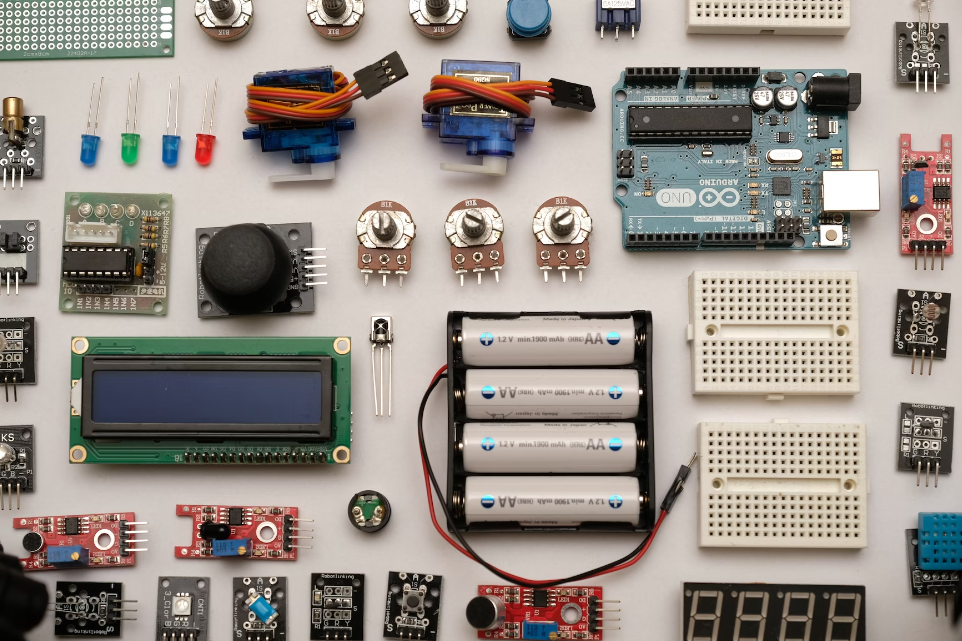

# Introducción
Se describen las características y principio de funcionamiento de los componentes básicos para construir circuitos que se montan para pruebas en placas de tipo micro:bit, Raspberry Pi o Arduino.

En ningún caso se pueden considerar unos apuntes de electrónica ni es esa su pretensión. Simplemente son unas notas de ayuda que sirvan para entender mejor los proyectos, actividades y retos que realicemos con este tipo de placas.

  
*Componentes electrónicos  Imagen obtenida de [n+neoteo](https://www.neoteo.com/) *

