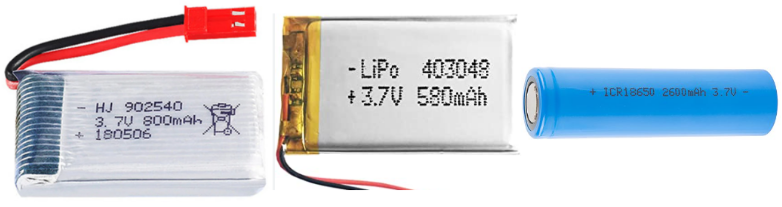

# Alimentación de Neopixeles
Vamos a comenzar por dar de forma destacada las tres recomendaciones que indican en la guía de Adafruit, que son:

<b>Orden de conexión de una fuente de alimentación o microcontrolador:

SIEMPRE PRIMERO la tierra

Orden de desconexión:

Se desconecta la tierra en ÚLTIMO lugar

____________________________________________________________________________

Como prevención y para evitar daños en el primer pixel por picos de tensión se recomienda poner unaresistencia de bajo valor (unos 75 ohmios) entre el pin de salida de datos de la placa de control y la entrada de datos del primer LED.

____________________________________________________________________________

Reserva de energía: Cuando se producen cambios abruptos en el brillo la fuente de alimentación por si sola no puede manejarlo y parecen fallar. Se aconseja poner un condensador electrolítico de gran capacidad (1000 uF) en paralelo con la alimentación para proporcionar esa energia extra que se requiere. SIEMPRE hay que respetar la polaridad del condensador.

</b>

## **Proyectos portátiles**
Se configuran con relativamente pocos LEDs y por lo tanto no tienen un excesivo consumo por lo que podemos alimentarlos con pilas o baterías.

* Las baterías recargables de una celda (figura siguiente) de polímero de litio entregan 3,7V que son perfectos para alimentar microcontroladores y unos pocos LEDs direccionables.

  
*Baterías Lipo 1S*

* Pilas AA o AAA. Se pueden usar tres pilas alcalinas con su correspondiente portapilas. Esto proporciona 4.5V. El inconveniente respecto a las baterías lipo es que son mas grandes y pesadas y la ventaja es que son muy fáciles de conseguir.

* Pilas recargables de hidruro metálico de níquel. En este caso hay que utilizar cuatro unidades de 1.2V con su soporte de cuatro celdas. Esto nos va a proporcionar 4.8V. Tenemos que asegurarnos de usar solamente pilas NiMH porque si colocamos pilas normales de 1.5V estaremos creando una tensión total de 6V y esto es muy probable que rompa el microcontrolador o algún LED.

* Otros medios pueden ser utilizar porwerbanks de la tensión adecuada o alguna de las anteriores de mayor tensión intercalando un convertidor reductor que se adapte a las condiciones de entrada de tensión de que disponemos y que su salida suministre los 5V requeridos. Hay que tener en cuenta el rango de tensión de entrada que requiere el convertidor específico y la corriente máxima de salida.

## **Proyectos de escritorio**
Si estamos hablando de tiras de hasta un metro con una fuente de alimentación conmutada de 5V/2A en CC típica tendremos suficiente.

Si se requiere mas corriente resulta tentador utilizar una fuente de laboratorio, pero hay que mucho cuidado porque pueden producir un gran pico de tensión cuando se encienden. Este pico es mas que suficiente para destruir instantáneamente los LEDs direccionables.

Si se usa una fuente de laboratorio, **NO** conectamos la tira directamente. Primero encendemos la fuente de alimentación, dejamos pasar unos segundo que el voltaje se estabilice, luego conectamos la tira, asegurándonos de conectar en primer lugar GND.

## **Requisitos de energia**
Cada LED individual consume hasta 60 miliamperios con el máximo brillo blanco (rojo + verde + azul). Sin embargo, en el uso real, es raro que todos los píxeles se enciendan de esa manera. Al mezclar colores y mostrar animaciones, el consumo puntual será mucho menor. Es imposible estimar un número para todas las circunstancias, pero se ha experimentado que usando la tercera parte de los 60 mA (20 mA por píxel) como regla general funciona correctamente. Pero si sabemos con certeza que necesitamos cada píxel con el máximo brillo, tenemos que usar la cifra 60 mA.

Para estimar las necesidades de suministro de energía, basta multiplicar la cantidad de píxeles por 20, o por 60 mA y obtendremos el consumo total en miliamperios. Por ejemplo:

60 LEDs × 20 mA = 1200 mA = 1.2 A como mínimo

60 LEDs × 60 mA = 3600 mA = 3.6 A como mínimo

256 LEDs x 20 mA = 5120 mA = 5.12 A como mínimo

256 LEDs x 60 mA = 15360 mA = 15.36 A como mínimo

La elección de la fuente de alimentación depende de nosotros pero es evidente que la máxima seguridad y fiabilidad se consigue con una fuente de alimentación de dimensiones más generosas, y esto es lo que recomendamos. La mayoría de las fuentes de alimentación pueden entregar un poco de corriente adicional durante períodos breves de tiempo e incluso algunas contienen un fusible térmico y simplemente se apagarán si se sobrecargan. Por lo tanto, aunque técnicamente pueden funcionar, digamos que no es recomendable abusar de ellas.

Un factor a tener en cuenta es que si vamos a alimentar con baterías estas se vuelven progresivamente mas pesadas, costosas y peligrosas, así que por razones de seguridad habría que minimizar el tamaño de las baterías.

Por otro lado tenemos que tener en cuenta la sección del conductor que será más barato y menos pesado cuanto menor sea esta, es decir, cuanta menor corriente deba soportar y que cuanto menor sea la corriente menor será el calor generado.

En general podemos decir que:

* La regla general de los "60 miliamperios" es solo eso... una regla general, no ciencia pura.
* Al animar y mezclar colores, el consumo de corriente será menor. A veces mucho menos.
* Incluso cuando se establece el color en 0 (LEDs apagados), la lógica del controlador dentro de cada Pixel usa una pequeña cantidad de corriente por debajo de 1 miliamperio por píxel, pero con muchos píxeles esto debería también sumarse.

La biblioteca NeoMatrix utiliza la corrección gamma para seleccionar niveles de brillo que son visualmente (aunque no numéricamente) equidistantes. Hay 32 niveles para rojo y azul, 64 niveles para verde. La función Color() realiza la conversión necesaria; no necesitamos hacer ningún cálculo. Acepta valores de rojo, verde y azul de 8 bits y devuelve un color de 16 bits con corrección gamma.

La respuesta final a todo esto es que usualmente los LEDs no estarían encendidos todos juntos, por lo que elegir una fuente de alimentación se vuelve una adivinanza. Podemos asumir para nuestros proyectos que el 75% de los pixels están encendidos en cualquier momento y que cada uno tiene solo un color, con lo que las corrientes anteriores quedan así:

60 LEDs: 45×20 mA = 0.9 A

256 LEDs: 192 x 20 mA = 3.84 A

512 LEDs: 384 x 20 mA = 7.68 A

La única forma 100% segura de saber con certeza el consumo es programar las luces y medir el consumo de corriente con un amperímetro.
