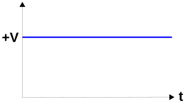
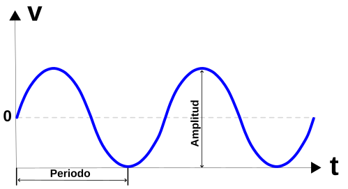
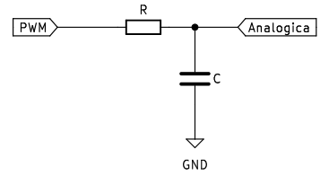
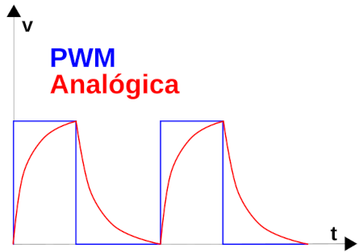
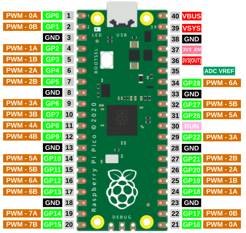
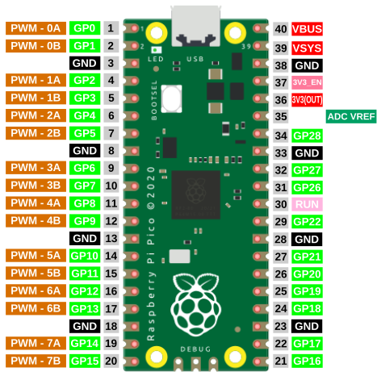

# Conceptos técnicos
Sección dedicada al estudio inicial de las señales en este tipo de electrónica y algunas formas de trabajar con las mismas.

Una señal eléctrica es una onda electromagnética que se utiliza para transmitir información o energia mediante circuitos electrónicos. Los tipos de señales mas comunes son:

## **Señales continuas (DC)**
Se trata de señales que mantienen su valor en el tiempo, como por ejemplo una tensión o corriente constante. En electrónica son tipicamente utilizadas para alimentar los circuitos, que normalmente requieren de una tensión de valor constante suministrada por una fuente de energia como por ejemplo las pilas o baterias.

  
*Señal continua*

## **Señales alterna (AC)**
Estas señales varian continuamente con el tiempo en periodos determinados. La forma mas común es la senoidal o sinusoidal. Su principal ventaja radica en que son fáciles de transformar en cuanto a niveles de voltaje de refiere. Es el tipo de corriente habitual en las tomas de corriente de nuestras casas, que es de 230V a 50Hz de frecuencia, lo que corresponden a un periodo de 20ms, es decir que la señal se repite cada 20ms.

  
*Señal alterna*

## **Señales digitales**
Vamos a ver una muy breve introducción a los circuitos digitales y analógicos que nos permita distinguir unos de otros y como tratar sus señales.

Una señal digital es una señal discreta en el tiempo y por tanto está formada por una secuencia de cantidades. Una señal digital puede cambiar instantaneamente su valor, como por ejemplo el estado de un pulsador, que puede estar accionado o no. En la práctica son señales que se denominan cuadradas, por su forma.

La electrónica digital utiliza magnitudes con dos valores discretos conocidos como '0 - 1, alto - bajo, on - off, High - Low', etc, y que se corresponden con la presencia o no de tensión en un determinado punto. Estos valores discretos pueden sufrir pequeñas variaciones en alguna variable del circuito pero, si no cambia el valor discreto no se produce ningún cambio en el comportamiento del circuito por lo que podemos decir que este no depende del valor exacto de la señal. En la figura siguiente vemos una señal digital típica.

  
*Señal digital*

## **Señales analógicas**
Una señal analógica es una señal que cambia de valor con el tiempo de manera continuada. En la vida real la mayoría de las señales son analógicas, como por ejemplo la temperatura, que a lo largo de un día está cambiando continuamente pero en valores discretos y no con cambios importantes. En la práctica son ondas que varian en función del tiempo.

La electrónica analógica por contra emplea magnitudes con valores continuos o variables continuas. Una pequeña variación en una variable puede producir un gran cambio en el comportamiento del circuito. En la imagen vemos un ejemplo de señal analógica simple.

  
*Señal analógica*

En las placas micro:bit disponemos de 25 conectores situados en el borde inferior. En general diremos que los pines son de tipo GPIO o pines de entrada/salida de propósito general. Algunos pines son para E/S serie, SPI e I2C

Un pin **GPIO** (General Purpose Input/Output, Entrada/Salida de Propósito General) es un pin genérico, cuyo comportamiento (incluyendo si es un pin de entrada o de salida) se puede programar por el usuario en tiempo de ejecución. En el apartado de información técnica siguiente se profundiza en que es cada pin.

## **Señal PWM**
PWM son siglas en inglés que significan <b>P</b>ulse <b>W</b>idth <b>M</b>odulation, que lo podemos traducir a español como modulación de ancho de pulso. Los pines PWM permiten generar una señal analógica mediante una salida digital mapeada con 8 bits, o lo que es lo mismo, valores del 0 al 255, es decir mediante una salida PWM podemos emular una señal analógica.

En realidad una placa microcontrolada no es capaz de generar una salida analógica y lo que se hace es emplear un truco que consiste en activar una salida digital durante un tiempo y el resto del tiempo del ciclo mantenerla desactivada. El valor promedio de la salida es el valor analógico. En el tipo de modulación PWM mantendremos constante la frecuencia, o lo que es lo mismo, el tiempo entre pulsos y lo que se hace es variar la anchura del pulso.

La proporción de tiempo que está encendida la señal, respecto al total del ciclo, se denomina ciclo de trabajo o Duty cycle, y generalmente se expresa en tanto por ciento. En la imagen siguiente vemos señales con distintos ciclos de trabajo.

  
*Distintos Duty cicle*

Las señales PWM emulan una señal analógica para aplicaciones como variar la luminosidad de un LED y variar la velocidad de motores de corriente continua.

Por ejemplo, si estamos trabajando con señales de 5V y queremos un PWM de 2V necesitamos una señal que el 40% ($\dfrac{2}{5}100$) del tiempo esté en alto (DC=40%) y el 60% restante en bajo.

Técnicamente lo que hacemos al variar el duty cycle de una señal PWM es variar la tensión media que se aplica al dispositivo con que se controla con esa señal. Esto cambia el comportamiento de dicho dispositivo, como por ejemplo en un LED varia el brillo, en un motor la velocidad, e incluso puede actuar en altavoces.

La utilidad de una señal PWM es hacer que un dispositivo digital entregue, además de los valores "1" y "0", una señal que podríamos considerar como analógica.

Si necesitamos mejorar la señal PWM para que se parezca mas a una analógica, lo mas sencillo es utilizar un filtro RC, que aprovecha la carga y descarga exponencial del condensador para hacer que los cambios de nivel no sean tan bruscos. La situación sería como la de la figura siguiente:

  
*Filtro RC*

Es **MUY IMPORTANTE** tener en cuenta que un filtro RC como el anterior, con señal de entrada procedente de una salida de un microcontrolador, podrá entregar una corriente baja a su salida.

Dependiendo de los valores de R y C la señal de salida variará, pero será algo similar a lo que vemos a continuación:

  
*Señales de entrada y salida en el Filtro RC*

Se trata de un filtro paso bajo que podemos calcular teniendo en cuenta la frecuencia de la señal PWM y el valor de la tensión de salida filtrada. Normalmente conocemos la tensión de salida y el duty cycle, y en un filtro RC los valores de tensión de salida y frecuencia de corte vienen dados por:

$v_0 = \dfrac{V_{in}}{\sqrt{1 + (2 \pi RC)^2}}  \space \space y  \space \space f_c = \dfrac{1}{2 \pi RC}$

Si suponemos una señal PWM de 500 Hz, con una tensión de 3.3V, un DC = 50% y que R = 10K y C = 1 uF, tenemos que:

$v_0 = \dfrac{3.3}{\sqrt{1 + (2 \pi 10x10^3 \cdot 1x10^{-6})^2}}  \space \space y  \space \space f_c = \dfrac{1}{2 \pi 10x10^3 \cdot 1x10^{-6}}$

$v_0 = 3.29 V\space \space y  \space \space f_c = 15.9 Hz$

En estas condiciones el rizado es de apenas 0.01V.

## **PWM en Rapberry Pi Pico**
En el caso de Raspberry Pi el nivel de tensión de salida es de 3.3 voltios.

Todos los pines GPIO de Raspberry Pi Pico pueden emitir señales PWM. La Raspberry Pi Pico tiene 8 generadores PWM independientes llamados slices. Cada slice tiene dos canales (A y B), lo que hace un total de 16 canales PWM.

Vamos a comenzar por ver un pinout desde el punto de vista del PWM.

  
*Pinout PWM de la Pi Pico*

Es posible seleccionar la misma salida PWM en dos pines GPIO y en cada GPIO aparecerá la misma señal. No obstante debemos tener cuidado y evitar conectar pines en combinaciones de letras y números ya empleados. Vamos a aclarar esto con un ejemplo: Es posible utilizar PWM-0A del GP0 y PWM-0B del pin GP1 e incluso añadir un tercer PWM-1A. Ahora bien, si intentamos configurar el GP16 como PWM-0A entraremos en conflicto porque PWM-0A ya se está utilizando en GP0.

Mas concretamente en la pico explorer esta posibilidad no se nos dará puesto que su pinout PWM es:

  
*Pinout PWM de la pico explorer*

